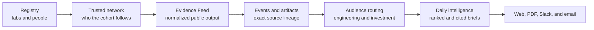

# Frontier Lab Intelligence

Frontier Lab Intelligence turns public output from frontier AI labs and key
people into a cited daily brief for investors and AI engineers. I built it for
the BIT Capital AI Engineer case study.

## Try the reviewer demo

```bash
./demo.command
```

On macOS, you can also double-click `demo.command`. The first run needs Python
3.13 and an internet connection. It downloads a 357 MB verified snapshot,
installs the local app, opens `http://127.0.0.1:8797`, and serves it in
read-only mode. It does not need API keys or provider credentials.

If the local app is already running on that port, the launcher simply opens it
and leaves its data and process unchanged.

The demo is local by design. The current product includes operator actions, so
I did not expose the writable server as a public website just to make the
submission easier to open.

## What the system does



The product keeps the evidence trail visible at every step. A reviewer can move
from a final Insight to its source Event, original post, artifact, routing
reason, and frozen run provenance.

## What is proven

- A curated Registry connects 2,500+ frontier AI entities to their public
  channels and a 557,363-account trust graph.
- A deterministic Feed and exact structural Events keep source chronology and
  relationships inspectable.
- Independent audience routing separates AI Engineering relevance from
  Investment relevance.
- Daily editorial runs produce ranked, cited web briefs and deterministic PDF
  reports.
- Real Slack and email delivery adapters have been validated, but they are
  disabled in the reviewer demo.

The final five submission Insights and their selection rationale are recorded
in the [submission proof selection](docs/projects/archive/daily-intelligence-quality/resources/submission-proof-selection-2026-07-19.md).
The [reviewer guide](docs/references/reviewer-guide.md) maps the product to the
case-study rubric.

## How the repository is organized

| Start here | Purpose |
| --- | --- |
| [`docs/STATUS.md`](docs/STATUS.md) | Current proof, limitations, and submission state |
| [`docs/architecture/overview.md`](docs/architecture/overview.md) | System boundaries and data flow |
| [`docs/architecture/code-map.md`](docs/architecture/code-map.md) | Code, store, command, and test ownership |
| [`docs/references/case-prompt.md`](docs/references/case-prompt.md) | Preserved external requirements |
| [`docs/references/demo-release.md`](docs/references/demo-release.md) | Exact demo snapshot and reproduction contract |
| [`AGENTS.md`](AGENTS.md) | Working rules for coding agents |

Code, tests, documentation, compact manifests, and the 14 MB Registry database
live in Git. Large raw and derived stores do not. The reviewer snapshot is an
immutable, checksummed object-storage release, so a clean clone remains small
without becoming an empty demo.

## Known limits

X is the implemented discovery source. Artifacts add papers, repositories,
articles, documents, and videos when first-party evidence points to them. Event
grouping follows exact provider relationships rather than semantic topic
clustering. The release is a bounded case-study proof, not a production alert
service.

Adithyan Ilangovan  
[adi@aipodcast.ing](mailto:adi@aipodcast.ing)
