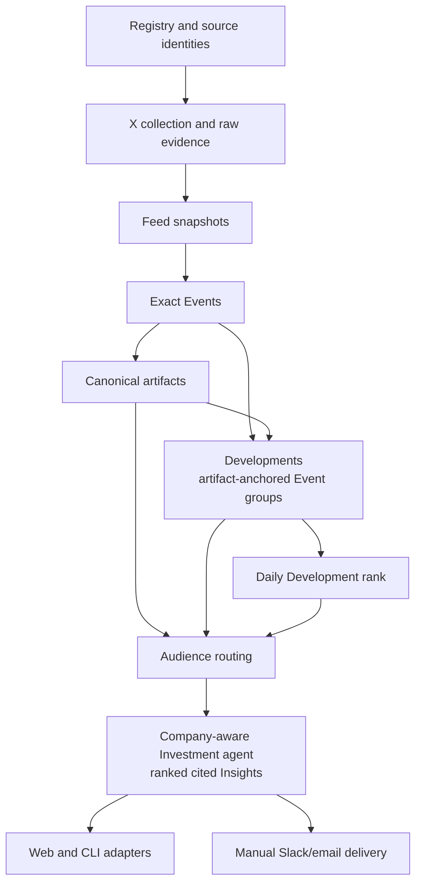

# Code and Data Map

This is the cold-start map for implementation work. Read it after
[`docs/STATUS.md`](../STATUS.md), then use [`overview.md`](overview.md) for the
system boundaries relevant to the task.

## Pipeline

Dependency direction is left-to-right. Domain code must not import `fli.web`.
The current exceptions are `fli.scoring.evaluation` and parts of the artifact
and routing run code that consume the Event API read model; remove those when
the Event read model moves out of `web`, not through new aliases.

## Source Ownership

| Area | Owner | What belongs there |
| --- | --- | --- |
| Shared runtime | `fli.llm_responses`, `fli.store` | Provider response normalization, deterministic cache-key lane grouping, and the compact product DB boundary. |
| Provider diagnostics | `fli.diagnostics.prompt_cache` | Non-mutating Luna/Terra reusable-prefix canary with stable JSON, typed errors, and cache/cost telemetry. |
| Ingestion | `fli.ingestion` | Public-source adapters, conference imports, raw X evidence, and date-complete collection. |
| Registry | `fli.registry.store`, `fli.registry.view`, and the other `fli.registry` workflows | Entity/channel mutation and curation stay in `store`; the API-facing read projection stays in `view`; admission, classification, evaluation, and seeds own their workflows. |
| Trusted network | `fli.network` | Immutable outgoing-follow snapshots, derived support/ranking analysis, and its read model. `provenance` owns the canonical JSON, file hash, checkpoint, and UTC identity shared by those frozen data products. |
| Evidence | `fli.evidence` | Deterministic Feed materialization, exact structural Events, artifact-anchored Development projection, and the end-to-end refresh client. Exact Events remain the immutable provenance unit. |
| Artifacts | `fli.evidence.artifacts.store`, `.fetch`, and `.cli` | Catalog/provenance persistence, retrieval/extraction, and the machine command adapter are separate boundaries. |
| Daily Development rank | `fli.scoring.development_attention` | Versioned lexicographic Development ordering. Production uses `daily-development-rank-v1`; the earlier exact-Event `daily-rank-v2` remains historical lineage only. |
| Audience routing | `fli.routing` | Independent Engineering/Investment relevance decisions, durable runs, audit view, and active prompt. |
| Insights | `fli.insights` | One path. `investment_agent` runs the cache-first company-aware loop and writes complete request/response traces; `investment_agent_runs` validates, stores, and projects them. The loop screens the compact universe, opens only plausible memos, then emits a minimal company assessment. `company_context` is the file-backed BIT/company read model; `pdf_report` renders one published cohort; `cli` is the machine adapter. Investment company selection follows `docs/references/investment-company-mapping.md`. |
| Delivery | `fli.delivery.daily_brief` | Manual Slack all-Insight and email top-five formatting, provider adapters, a same-origin confirmation guard, and reuse of the canonical cached PDF. It does not own Insight data or scheduling. |
| Web | `fli.web.app`, `fli.web.feed`, `fli.web.events`, `fli.web.developments`, `fli.web.artifact_library` | HTTP composition and read projections only. `/api/events` preserves exact Event inspection; `/api/developments` is the ranked Feed read model; `/api/developments/analysis-packet` renders the exact read-only routing input without a model call. Built SPA assets live in `fli.web.dist`; editable UI source is `frontend/`. |
| Root client | `fli.cli` | Thin subcommand router only; domain behavior belongs to the owning area. |
| Demo release | `demo.command`, `scripts/demo.py`, `scripts/build-demo-release.py` | Verified snapshot restore, read-only launch, and operator-only release construction. The release contract is `data/demo-release.json`. |

The root package contains only cross-domain runtime plumbing (`cli`,
`llm_responses`, and the compact product `store`). Operational provider probes
live in `fli.diagnostics`; domain behavior belongs in the packages above. Do
not add compatibility modules at former flat paths.

## Frontend Ownership

The React source mirrors product domains rather than collecting unrelated
routes in a generic `pages/` directory:

| Area | Owner | What belongs there |
| --- | --- | --- |
| App composition | `frontend/src/app/` | Route composition and the shared audit-date provider only. |
| System guide | `frontend/src/features/system/` | The `/how` shell composes an interactive story, a long-form narrative, and structured page content; the live checkpoint and shared System layout stay local to the same feature. |
| Architecture | `frontend/src/features/architecture/` | The deeper technical diagrams and their local presentation logic. |
| Evidence | `frontend/src/features/evidence/` | Feed, Artifact index, their workspace layout, and Evidence-only view state. |
| Insights | `frontend/src/features/insights/` | Audience Insight inspection, decision-state UI, selected daily brief PDF download, and the explicit Slack/email delivery confirmation. |
| BIT Lens | `frontend/src/features/bit-lens/` | Public BIT research brief plus the auditable company-context ledger. The index comes from the canonical Investment packet; promoted web-grounded memos come from `docs/references/company-memos/`. |
| Network | `frontend/src/features/network/` | Registry, Ranking, Add Profile, their workspace layout, and the shared entity detail surface. |
| Shared UI | `frontend/src/shared/` | Cross-feature API contracts, date state, text normalization, and genuinely reused components. |
| Styles | `frontend/src/styles/` | Domain styles in cascade order; `app.css` is imports only and remains the single entrypoint. |

`frontend/src/main.tsx` is the only TypeScript entrypoint at the source root.
Prefer feature-local code until two product domains genuinely share a contract;
do not recreate generic `pages/` or `components/` buckets.

## Store Ownership

| Store | Writer | Main readers | Lifecycle |
| --- | --- | --- | --- |
| `data/fli.db` | Registry/source commands | Registry, network, Feed, web | Tracked compact product/demo state; never a raw crawl sink. |
| `data/raw/x/x-content.db` | X collection | Feed, Registry evaluation | Immutable provider cache plus normalized observations; preserve to avoid paid refetches. |
| `data/raw/following/<snapshot>/snapshot.db` | Following snapshot client | Following ranking | Immutable ignored crawl snapshot; manifests under `data/following/` bind checksums and lineage. |
| `data/derived/following/<snapshot>/analysis.db` | Following ranking | Feed and Network UI | Rebuildable analysis for one frozen snapshot. |
| `data/derived/signal-feed/feed.db` | `fli signal-feed` / `fli evidence-refresh` | Events, routing, Feed UI | Rebuildable current Feed projection. |
| `data/derived/signal-events/events.db` | `fli signal-events` / `fli evidence-refresh` | Artifacts, routing, Event UI | Rebuildable exact Event projection with an explicit date-to-run publication map. |
| `data/derived/artifacts/artifacts.db` | Artifact catalog/fetch commands | Routing and artifact UI | Durable local catalog; daily imports append dated lineage, while raw bodies and clean text are content-addressed beside it. |
| Development read model | No independent writer | Feed, routing, artifact UI | Deterministic projection over exact Events plus accepted canonical artifacts. It is cached in process and rebuilt when either source store changes; there is deliberately no separate Development database yet. |
| `data/derived/audience-routing/*/routing.db` | `fli audience-routing` | Feed, Insights, rank evaluation | Immutable per-day runs. Current-compatible runs bind their source Feed/Event publication and full-day Development rank-input SHA. |
| `data/derived/insights/investment-agent-traces/<day>/*.json` | `fli insights run-investment-agent` | Investment import, operator audit | Durable exact request/response envelopes for every model turn, plus response IDs, retryable and terminal request failures, memo calls and packets, usage, cost, and the validated final result. |
| `data/derived/insights/investment-agent.db` | `fli insights run-investment-agent` / `import-investment-trace` | Investment Insights API/UI | Durable company-aware successor runs. Each row binds the Development, prompt/model identity, compact-universe and evidence hashes, exact memo calls, token/cache/cost telemetry, and validated minimal result. A per-day publication records the complete current Investment-routed cohort; readers never infer the active day from every historical row. |
| `data/derived/insights/pdf-cache/` | `GET /api/insights/report.pdf` | Daily Insight PDF downloads | Rebuildable content-addressed PDFs keyed by report schema, read schema, date, audience, and published-cohort result hash; atomic writes make concurrent first requests safe. |
| `data/derived/web-event-cache/` | Event API read model | Event API and Feed UI | Optional compressed exact-view cache, automatically invalidated by source database versions and projection code. Safe to delete; source stores remain authoritative. |

Manual delivery adds no second report or outbox store. It reads the complete
published Investment projection and reuses the PDF cache at confirmation time.

See [`data/README.md`](../../data/README.md) for directory lifecycle and
[`docs/references/data-lifecycle.md`](../references/data-lifecycle.md) before
removing or archiving local data.

## Commands

- Refresh one new UTC day without moving older publications:
  `fli evidence-refresh --day YYYY-MM-DD`
- Rebuild an intentional historical Evidence window:
  `fli evidence-refresh --through YYYY-MM-DD --days N`
- Materialize individual boundaries: `fli signal-feed`, `fli signal-events`,
  `fli artifacts`
- Route Evidence: `fli audience-routing`
- Generate or inspect Insights: `fli insights`. Run the company-aware
  Investment loop with `fli insights run-investment-agent`; add `--dry-run` to
  resolve and validate the exact cohort without model calls, traces, database
  writes, or publication. Import one already completed trace with `fli insights
  import-investment-trace`, read the live contract with `fli insights
  contract`, and inspect the company packet with `fli insights
  company-context` or `fli insights company-universe`.
- Inspect the daily Development rank: `/api/developments` or the Feed. The
  historical `fli daily-rank evaluate` command still evaluates exact-Event
  `daily-rank-v2` lineage.
- Inspect one exact future routing input without running the model:
  `/api/developments/analysis-packet?date=YYYY-MM-DD&development_id=...` or
  `Preview what audience analysis reads` inside the expanded Feed Development.
- Run the product: `fli web` or the always-on service at
  `http://127.0.0.1:8797`
- Open the hosted product:
  `https://frontier-lab-intelligence.adithyan.io/`
- Restore and run the frozen reviewer release: `./demo.command`

All repeated LLM work uses the shared LiteLLM path and the exact contracts in
`AGENTS.md`; do not introduce provider-specific calls inside a domain.

## Tests and Validation

- Tests mirror stable packages under `tests/ingestion/`, `tests/registry/`,
  `tests/network/`, `tests/evidence/`, `tests/routing/`, `tests/scoring/`, and
  `tests/insights/`.
- HTTP contract tests follow the projection they exercise; the Insight read
  model currently lives with the Insight domain.
- Run focused tests while editing, then `bash scripts/check-fast.sh` before
  handoff.
- Build UI changes with `npm --prefix frontend run build`; the output under
  `src/fli/web/dist/` is intentionally tracked and served by the always-on app.

## Where Exact Details Live

- System boundaries: [`overview.md`](overview.md)
- Detailed implemented contracts: [`implementation-contracts.md`](../references/implementation-contracts.md)
- Current proof and critical path: [`docs/STATUS.md`](../STATUS.md)
- Feed/Event contract: [`signal-feed.md`](../references/signal-feed.md)
- End-to-end Evidence refresh: [`evidence-refresh.md`](../references/evidence-refresh.md)
- Artifact contract: [`artifact-library.md`](../references/artifact-library.md)
- Insight refresh/client: [`insight-refresh.md`](../references/insight-refresh.md)
- Model routing contract: [`model-routing.md`](../references/model-routing.md)
- Prompt-cache contract and live proof: [`prompt-caching.md`](../references/prompt-caching.md)
- Measured workflow and provider economics: [`tokenomics.md`](../references/tokenomics.md)
