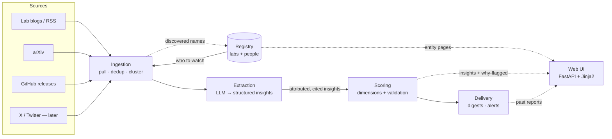
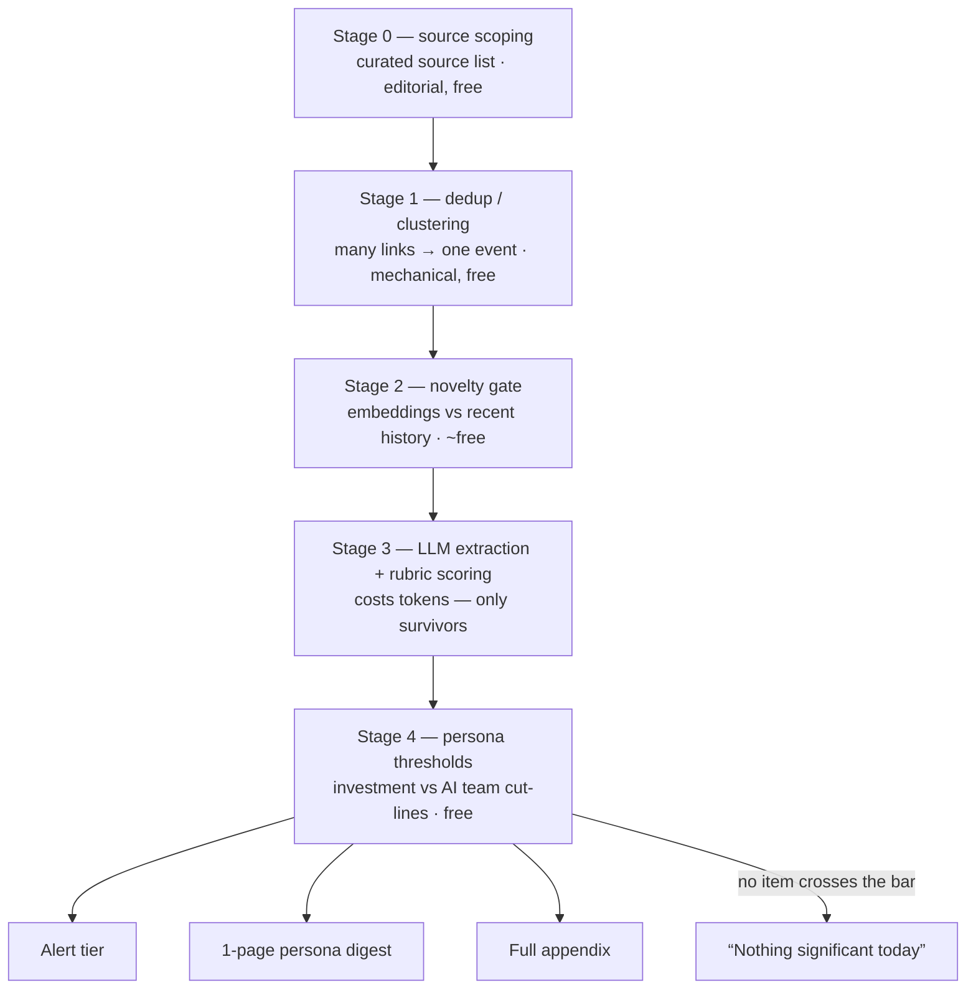
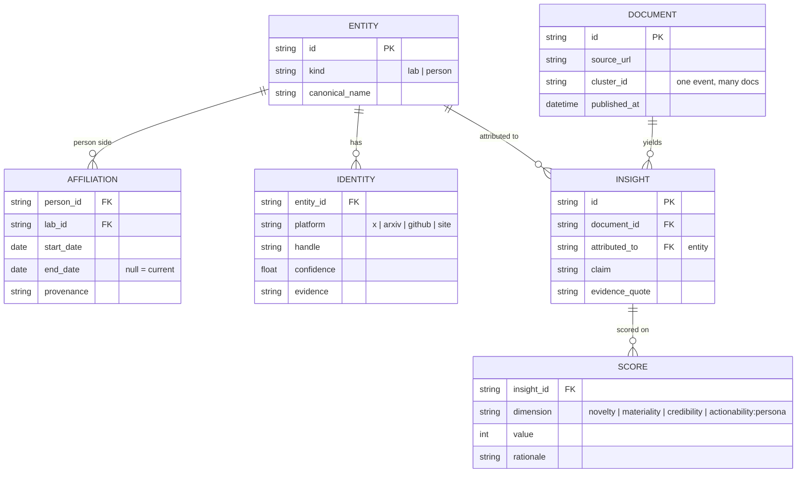

# Architecture Overview

The living visual map of the system. **Contract: any change to system shape
(new module, new pipeline stage, schema change) updates this doc in the same
change.** Diagrams are Mermaid — they render on GitHub and in most editors.

Prose rationale (why these choices): `docs/references/solution-architecture.md`.
Status: pre-implementation — this reflects the Phase 0 design; boxes appear
here before code exists, then get annotated as they land.

## System pipeline

Five stages, each an independently runnable CLI step, sharing one SQLite DB.



## Signal funnel (where noise dies)



Judgment is encoded in exactly two places: the source list (S0) and the
scoring rubric (S3). Everything else is mechanical and testable.

## Data model (core registry)



Affiliations are dated claims, never fixed attributes — people move, and the
move itself is a signal.

## Repo layout

```
src/fli/          the installable package — only shippable code
  cli.py          pipeline entrypoint (stages become subcommands)
  (planned) registry.py · ingest.py · extract.py · scoring.py · delivery.py · web/
tests/            mirrors src/fli one-to-one (test_scoring.py ↔ scoring.py)
docs/
  architecture/   ← this doc (visual map, kept current)
  references/     durable decisions, prompt, assumptions, logs
  learning/       plain-words DS/ML entries (do → learn contract)
  projects/       execution tracker
data/             local data paths (large/raw data stays untracked)
scripts/          check-fast.sh and repo tooling
```

## Module status

| Module | Status |
| --- | --- |
| `fli.cli` | ✅ stub (`--version`, help, `web` subcommand) |
| `fli.registry` | 📐 designed (Phase 0) |
| `fli.ingest` | 📐 designed |
| `fli.extract` | 📐 designed |
| `fli.scoring` | 📐 designed |
| `fli.delivery` | 📐 designed |
| `fli.web` | ✅ shell: home + `/architecture` (renders this doc with Mermaid); register/insights/reports pending |
