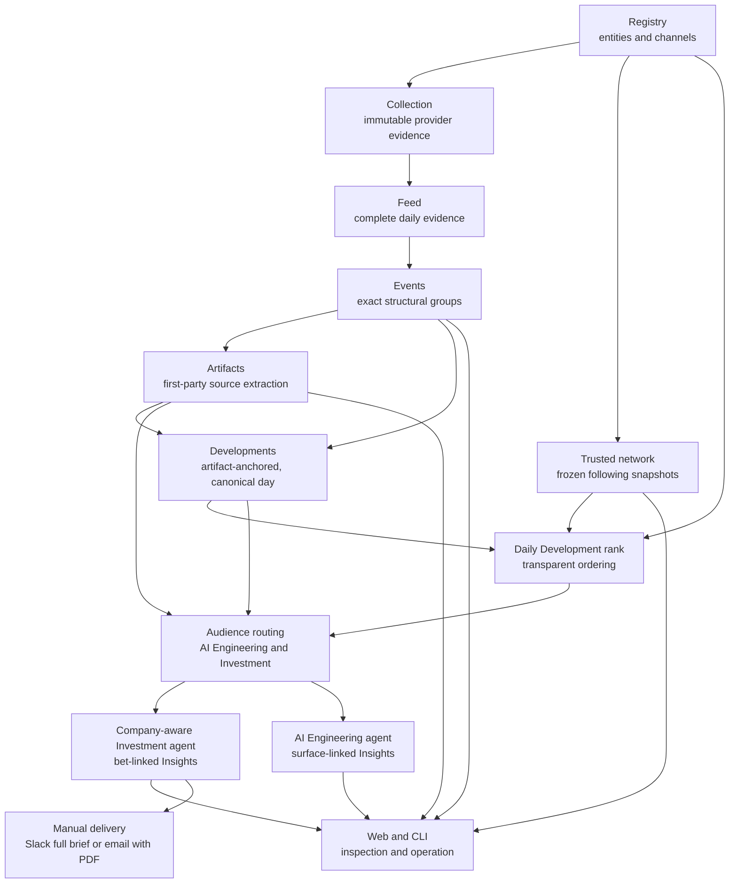

# Architecture Overview

Frontier Lab Intelligence turns public frontier-AI activity into inspectable
evidence, independent audience-routing decisions, company-aware Investment
intelligence, and surface-linked AI Engineering intelligence. The system
deliberately separates deterministic evidence construction from model
judgment: agents can rebuild and audit the evidence before asking a model what
it means. Each audience has one generator, store, and read projection; neither
has a legacy product fallback.

Use the [code and data map](code-map.md) to locate an owner, command, store, or
test. The
[implementation contract index](../references/implementation-contracts.md)
routes exact schemas, run telemetry, and historical facts to their scoped
documents under `docs/references/`.

## System Shape



The dependency direction is downward. Raw and deterministic stages never
depend on a downstream model decision. Rebuilding a later stage cannot mutate
or reinterpret its upstream evidence.

## Main Parts

| Area | Package | Responsibility |
| --- | --- | --- |
| Registry | `fli.registry` | Canonical people, organizations, channels, provenance, admission, and curation. |
| Ingestion | `fli.ingestion` | Public-source adapters, raw X storage, and date-complete collection. |
| Trusted network | `fli.network` | Frozen outgoing-follow evidence and derived entity-support rankings. |
| Evidence | `fli.evidence` | Deterministic Feed snapshots, exact structural Events, artifact-anchored Developments, and one refresh workflow. |
| Artifacts | `fli.evidence.artifacts` | Canonical source links, lineage, retrieval, and extracted text. |
| Daily Development rank | `fli.scoring.development_attention` | Versioned, inspectable lexicographic ordering of canonically published Developments. |
| Audience routing | `fli.routing` | Independent AI Engineering and Investment relevance decisions with durable runs. |
| Insights | `fli.insights` | Separate Investment and AI Engineering agents with strict result validation, exact traces, atomic cohort publication, and audience-specific read models. |
| Delivery | `fli.delivery` | Explicitly confirmed Slack and email adapters over one canonical Daily Brief; credentials and provider behavior remain server-side. |
| Provider diagnostics | `fli.diagnostics` | Non-mutating machine-readable checks of shared provider behavior, including reusable-prefix cache telemetry. |
| Product adapters | `fli.web`, `fli.cli` | HTTP/UI composition and non-interactive commands; no domain truth belongs here. |

Cross-domain provider behavior belongs in `fli.llm_responses`; compact tracked
product state belongs in `fli.store`; operational probes belong in
`fli.diagnostics`. The root-level modules remain limited to shared runtime and
composition.

## Main Flow

1. The Registry defines the tracked identities and their source channels.
2. Collection stores immutable provider responses and normalized observations.
3. Feed materialization selects complete UTC days and preserves exact relation
   and discovery history.
4. Events group only provider-declared structural relationships. They do not
   perform topic clustering.
5. Artifact enrichment admits source links only from the root author and that
   author's same-conversation continuation.
6. The Development projection groups same-day exact Events only when their
   independently authored root posts point to the same accepted,
   release-specific canonical artifact. Generic home pages are not merge
   anchors. The artifact's earliest accepted Event day owns the resulting
   Development; later independently authored links do not republish the same
   Development ID. Exact Event IDs, authors, posts, activity, and artifact
   lineage stay attached, so grouping never erases provenance. The projection
   is deterministic and rebuildable; it does not need its own database yet.
7. Daily Development ranking orders each complete day with
   `daily-development-rank-v1`: distinct Registry participants across every
   source Event, then their mean network position, then the largest public
   interaction total on one source post, then stable Development ID. Original
   authors, quote authors, and reposters each count once per Development.
   There is no organization bonus, scalar score, or topic-model judgment.
   Network positions are tie-aware entity-support percentiles, and the complete
   day's exact inputs are bound into one lineage hash.
8. Audience routing independently decides whether the packet matters to AI
   Engineering and Investment. One Development packet contains every current
   independently authored source post, current substantive same-author
   continuations, and each retrieved shared artifact once. Third-party reaction text stays out of
   the semantic packet even though trusted authors, quoters, and reposters
   still shape rank. Before any model call, one deterministic evidence-readiness
   gate completes a Development as not relevant when it contains native photo,
   video, GIF, audio, Spaces, or native-video evidence that the packet builder
   does not inspect. Readable linked articles, blogs, PDFs, repositories, and X
   Articles remain eligible. The same gate handles a single X post with no more
   than 30 substantive words and no artifact, author continuation, or
   independently authored corroboration, plus packets whose only linked
   evidence was unavailable. Its stored reason names the exact condition; the
   Development remains inspectable and consumes no model tokens. The Feed
   exposes the exact rendered packet through a
   read-only preview that never calls a model. New routing freezes admit only
   first-party X sources no more than seven days old; a current same-author
   continuation may replace an older root, while old-only packets are excluded. A multi-day
   routing refresh freezes every requested date against one global Event publication,
   then routes days in parallel. New publication-qualified runs automatically
   reuse a predecessor judgment only when the same Event has exact frozen
   evidence and rendered model input under the same routing contract; changed
   or newly ranked Events alone require model work. Every new run records the
   current source Feed/Event IDs and full-day rank-input hash, and readers reject
   stale rank lineage.
9. The company-aware Investment agent first selects only Developments with a
   current, positive Investment route. “Top ten” means up to the ten highest daily
   ranks inside that Investment lane, not the first ten Developments in the
   union-positive Feed. A direct single-rank run fails closed when that rank is
   not Investment-routed. The agent then reads the complete Development and a
   compact, stable card for every company in the 37-name universe. Each card
   names that company's pre-registered standing bets. It rejects uncertain
   matches at this screening stage. Only when the Development supplies a
   concrete causal path may it call the local memo tool for a company. It then
   either omits that candidate after inspection or emits a connection containing
   the ticker, one valid memo-owned bet id, a short impact, and
   `threshold_met`. The model never restates bet direction. Application code
   resolves `upside | downside` from the cited memo, so BIT Lens, Insights, PDF,
   and delivery cannot diverge. `threshold_met` is true only when the
   Development establishes the cited bet's pre-registered threshold now; false
   is an early signal, not a rejection. The final result also carries one
   concise investment headline, a factual Development summary, the shared
   causal mechanism for each group of connected companies, and a reason when
   the Development is suppressed. Application code supplies the exact Feed
   Development and company-memo links; the model does not generate URLs or
   restate the source ledger. The durable run binds evidence and universe
   hashes, exact memo calls, prompt/model identity, and token/cache/cost
   telemetry. A complete v15 run publishes its exact candidate cohort;
   publication requires a completed v15 row for every member, and readers
   project only v15 members. A multi-day refresh validates and replaces the
   complete requested day set in one transaction, so canonical Development
   ownership can move between days without exposing partial state. Partial
   reruns, legacy prompt versions, and older out-of-lane results therefore
   cannot leak into the current publication.
   `fli insights
   run-investment-agent` owns the production loop: it
   completes one warm request for the stable prompt key, runs the remaining
   requested ranks with bounded parallelism, writes the exact request and
   response for every turn under
   `data/derived/insights/investment-agent-traces/<day>/`, and imports each
   successful result into the read database. Transient connection, timeout,
   408, 409, 429, 499, and 5xx failures receive at most three
   application-owned attempts. Every failed attempt and exact request is
   written to the trace before retry; permanent request errors fail
   immediately. Sol/xhigh top-ten passes now cover July 5–28 as the persisted
   calibration proof of this successor boundary.
10. The 37 web-grounded company memos live in the single generated packet
   `docs/references/company-memos.json`; BIT Lens projects each company with its
   exact source ledger. The reproducible simplifier binds every one of the 176
   standing bets to the audited binary-direction ledger in
   `docs/references/company-bet-directions.json`, rejects stale source hashes,
   and emits `company-memos-v3`. Every bet contains one stable id, binary
   direction, causal condition, exposure, consequence, explicit threshold,
   watchpoints, and source ids. `fli.insights.company_context` is the only
   runtime reader of that packet and validates every profile, holding, memo,
   bet id, and binary direction before it reaches the product.
11. The AI Engineering agent independently selects up to the ten highest daily ranks
   with a positive Engineering route. One Sol/high Responses call compares the
   complete Development packet with the seven versioned Aion surfaces in
   `docs/references/aion-surfaces.json`. A surfaced result names at most two
   surfaces and explains what engineering decision the evidence could change;
   a suppressed result preserves its reason. The agent has no company memo
   tool, bet direction, or materiality gate. Exact request/response traces,
   prompt and surface-map hashes, usage, cost, and the validated final result
   are stored before an all-or-nothing v2 daily publication. Current top-ten
   cohorts cover July 5–28.
12. The web and CLI expose the frozen evidence, decisions, provenance, and
   operational status without becoming alternate data owners. For a complete
   published Investment cohort, the web adapter can deterministically render the
   same audience/date projection as a linked A4 PDF. The content-addressed
   derived cache is an acceleration layer, not another report or Insight store.
   The AI Engineering reader links surface landings into the Aion map and has
   no PDF or delivery action.
13. An operator may explicitly deliver that same complete Investment
   audience/date brief.
   Slack presents every surfaced Insight with its `What changed` text and
   memo-owned company directions, then links to the complete brief. Email
   receives up to five ranked Insights with the cached PDF attached.
   The write route accepts only same-origin browser confirmations, provider
   secrets never enter the SPA, and no scheduler or automatic alert loop is
   implied by this manual adapter. This is a deliberate lightweight boundary,
   not user authentication.

## Important Boundaries

- **Immutable inputs:** paid or irreproducible provider responses are cached
  under `data/raw/`; normalized and derived stores can be rebuilt from them.
- **Current versus historical state:** current readers use only canonical paths
  documented in the code map. Historical run identity remains in manifests,
  prompt/schema versions, hashes, and archived project records.
- **Daily Evidence publication:** normal forward collection builds one complete
  UTC day and updates only that date's Feed/Event publication. Earlier dates
  retain their source run identities, and daily artifact imports append rather
  than replace prior observations.
- **Historical Insight refresh:** for an intentional historical window,
  publish Feed and Events once through the maximum requested date, route the
  complete range against that snapshot, preview each audience's exact cohort,
  then run the relevant audience agent. Each runner fans out targets with
  bounded workers. Investment replaces the complete requested day set
  atomically after every target succeeds; AI Engineering publishes a day only
  after every requested target for that day succeeds. Several Evidence
  publishers must not compete for the same date publication.
- **Exact Event identity:** quote, retweet, reply-parent, and first-party thread
  relationships may group evidence; shared topic or conversation text may not.
- **Dynamic curation:** Feed and Event readers overlay current Registry state so
  rejected identities disappear without rewriting raw history.
- **First-party model evidence:** independent reactions remain auditable in the
  Feed but cannot silently become primary artifact or Insight evidence. The
  Feed's analysis-packet preview renders the same deterministic Markdown
  reading view used by routing: attributed source posts, substantive author
  updates, and each supporting artifact once. Opening it does not run routing
  or Insight generation.
- **Fresh semantic evidence:** raw Events retain their history, while routing
  and daily authoring use only first-party X posts from the brief day through
  seven days earlier. Current same-author continuations may replace old roots;
  third-party reactions may not rescue them.
- **Artifact availability versus support:** the artifact catalog owns exact
  disclosure lineage, and the workspace exposes it without a second automatic
  artifact gate. The daily agent audits timing and relevance, then grounds any
  citation in a verified passage relevant to the Insight claim.
- **Independent audiences:** Engineering and Investment are separate judgments
  over one shared evidence core, not two ingestion systems.
- **One canonical Development day:** an artifact-based Development belongs to
  the artifact's earliest accepted Event day. Both audience publication stores
  reject any attempt to publish one Development ID on multiple days.
- **Derived delivery cache:** a PDF cache key binds the report renderer version,
  canonical read schema, selected day and audience, and imported result hash.
  Cache files are atomically replaceable and may be deleted without losing
  Insight truth; the normalized run remains the only report input.
- **Explicit delivery boundary:** delivery reads only the canonical complete
  brief and its derived PDF. A human confirmation owns each send; Slack, SMTP,
  and email credentials are runtime secrets and never part of product data.
- **Agent freedom behind a narrow write boundary:** the agent may search,
  compare, group, and research freely, but only a versioned Insight schema and
  complete candidate disposition may enter product state.
- **Versioned model contracts:** active prompts use stable semantic filenames;
  immutable runs store prompt version, schema version, and prompt/input hashes.
- **Shared model adapter:** every LLM call goes through the LiteLLM Responses
  boundary with stable metadata, measured cache telemetry, and captured cost.
  The Investment runner completes one warm request for its stable prefix before
  bounded parallel fanout; Engineering uses one bounded single-call lane. The
  provider remains the source of truth for whether later requests actually
  reused cached input.
- **No compatibility maze:** migrations use direct imports and canonical data
  paths. Old module aliases and dual reads are not retained by default.
- **Artifact targets remain document-shaped:** exact generic `/search`
  navigation endpoints are excluded both when first observed and when reached
  through redirects, so changing listing content cannot enter semantic packets.
- **External action remains explicit:** publishing, alerts, uploads, and case
  submission require current-session human approval.

## Agent Change Rule

Start at the owning package and its mirrored tests. Update this overview only
when the system shape or dependency direction changes. Update the relevant
reference when an exact contract, schema, cache rule, command, or store changes.
Routine work is tracker-free. Use a project tracker only when Adi explicitly
invokes `$project` for work that needs a durable multi-session plan.

Validation is one command:

```bash
bash scripts/check-fast.sh
```

It validates the docs/build log, compiles and tests Python, audits live artifact
lineage when local data exists, runs frontend contract tests and lint, and
builds the production SPA.

## Exact References

- [Code and data ownership](code-map.md)
- [Current system status](../STATUS.md)
- [Implementation contract index](../references/implementation-contracts.md)
- [Local data lifecycle](../references/data-lifecycle.md)
- [Feed and Event contract](../references/signal-feed.md)
- [Evidence refresh workflow](../references/evidence-refresh.md)
- [Artifact library contract](../references/artifact-library.md)
- [Model routing policy](../references/model-routing.md)
- [Prompt-cache contract and live proof](../references/prompt-caching.md)
- [Insight refresh/client](../references/insight-refresh.md)
