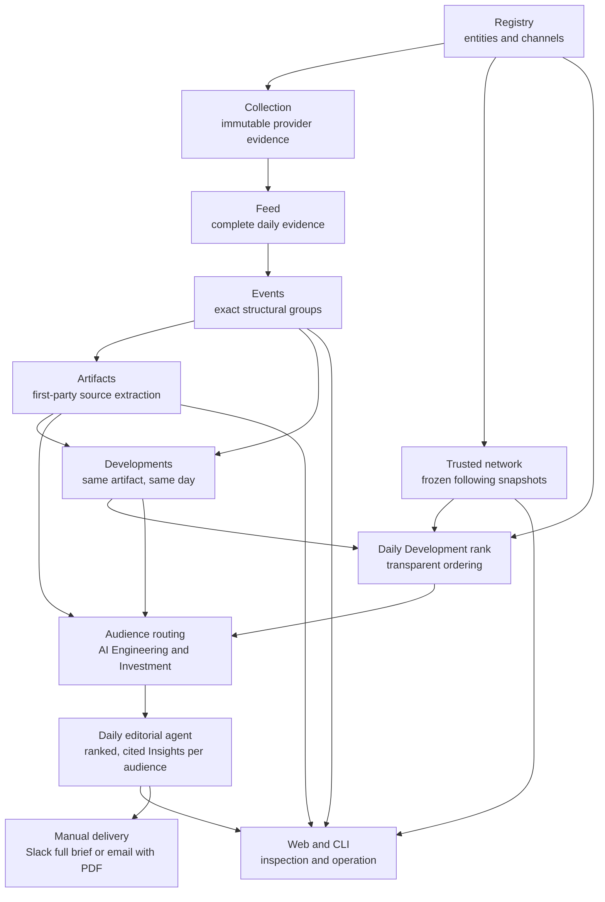

# Architecture Overview

Frontier Lab Intelligence turns public frontier-AI activity into inspectable
evidence and two audience-specific intelligence views. The system deliberately
separates deterministic evidence construction from model judgment: agents can
rebuild and audit the evidence before asking a model what it means.

Use the [code and data map](code-map.md) to locate an owner, command, store, or
test. Exact schemas, run telemetry, and historical implementation facts live in
[implementation contracts](../references/implementation-contracts.md) and the
other documents under `docs/references/`.

## System Shape



The dependency direction is downward. Raw and deterministic stages never
depend on a downstream model decision. Rebuilding a later stage cannot mutate
or reinterpret its upstream evidence.

## Main Parts

| Area | Package | Responsibility |
| --- | --- | --- |
| Registry | `fli.registry` | Canonical people, organizations, channels, provenance, admission, and curation. |
| Ingestion | `fli.ingestion` | Public-source adapters, raw X storage, and date-complete collection. |
| Trusted network | `fli.network` | Frozen outgoing-follow evidence and derived entity-support rankings. |
| Evidence | `fli.evidence` | Deterministic Feed snapshots, exact structural Events, artifact-anchored Developments, and one refresh workflow. |
| Artifacts | `fli.evidence.artifacts` | Canonical source links, lineage, retrieval, and extracted text. |
| Daily Development rank | `fli.scoring.development_attention` | Versioned, inspectable lexicographic ordering of same-day Developments. |
| Audience routing | `fli.routing` | Independent AI Engineering and Investment relevance decisions with durable runs. |
| Insights | `fli.insights` | Per-Event working annotations plus agent-authored daily synthesis, strict validation, atomic storage, and the canonical read model. |
| Delivery | `fli.delivery` | Explicitly confirmed Slack and email adapters over one canonical Daily Brief; credentials and provider behavior remain server-side. |
| Provider diagnostics | `fli.diagnostics` | Non-mutating machine-readable checks of shared provider behavior, including reusable-prefix cache telemetry. |
| Product adapters | `fli.web`, `fli.cli` | HTTP/UI composition and non-interactive commands; no domain truth belongs here. |

Cross-domain provider behavior belongs in `fli.llm_responses`; compact tracked
product state belongs in `fli.store`; operational probes belong in
`fli.diagnostics`. The root-level modules remain limited to shared runtime and
composition.

## Main Flow

1. The Registry defines the tracked identities and their source channels.
2. Collection stores immutable provider responses and normalized observations.
3. Feed materialization selects complete UTC days and preserves exact relation
   and discovery history.
4. Events group only provider-declared structural relationships. They do not
   perform topic clustering.
5. Artifact enrichment admits source links only from the root author and that
   author's same-conversation continuation.
6. The Development projection groups same-day exact Events only when their
   independently authored root posts point to the same accepted,
   release-specific canonical artifact. Generic home pages are not merge
   anchors. Exact Event IDs, authors, posts, activity, and artifact lineage stay
   attached, so grouping never erases provenance. The projection is
   deterministic and rebuildable; it does not need its own database yet.
7. Daily Development ranking orders each complete day with
   `daily-development-rank-v1`: distinct Registry participants across every
   source Event, then their mean network position, then the largest public
   interaction total on one source post, then stable Development ID. Original
   authors, quote authors, and reposters each count once per Development.
   There is no organization bonus, scalar score, or topic-model judgment.
   Network positions are tie-aware entity-support percentiles, and the complete
   day's exact inputs are bound into one lineage hash.
8. Audience routing independently decides whether the packet matters to AI
   Engineering and Investment. One Development packet contains every current
   independently authored source post, current substantive same-author
   continuations, and each retrieved shared artifact once. Third-party reaction text stays out of
   the semantic packet even though trusted authors, quoters, and reposters
   still shape rank. The Feed exposes the exact rendered packet through a
   read-only preview that never calls a model. New routing freezes admit only
   first-party X sources no more than seven days old; a current same-author
   continuation may replace an older root, while old-only packets are excluded. A multi-day
   refresh freezes every requested date against one global Event publication,
   then routes days in parallel. New publication-qualified runs automatically
   reuse a predecessor judgment only when the same Event has exact frozen
   evidence and rendered model input under the same routing contract; changed
   or newly ranked Events alone require model work. Every new run records the
   current source Feed/Event IDs and full-day rank-input hash, and readers reject
   stale rank lineage.
9. The company-aware Investment agent first reads the complete Development and
   a compact, stable card for every company in the 37-name universe. It rejects
   uncertain matches at this screening stage. Only when the Development supplies
   a concrete causal path may it call the local memo tool for a company. It then
   either rejects that candidate after inspection or emits one minimal
   assessment: bottom line, mechanism, affected business driver, direction,
   main uncertainty, and one next check. The final result also carries one
   concise, investment-facing headline written after company analysis.
   Application code supplies the exact
   Feed Development and company-memo links; the model does not generate URLs or
   restate the source ledger. The durable run binds evidence and universe
   hashes, exact memo calls, prompt/model identity, and token/cache/cost
   telemetry. A July 21 Sol/xhigh pass across the top ten is the current
   persisted calibration proof of this successor boundary; full-day replay
   remains future work.
10. A daily editorial agent reviews the complete routed-positive cohort, reads
   the skill-owned BIT thesis, audited 2025 portfolio, and source-graded company
   profiles for Investment. Its compact index keeps all 37 profiles eligible.
   The 37 web-grounded company memos live independently in
   `docs/references/company-memos/`; BIT Lens projects them with their exact
   source ledger and generation provenance. The read contract still exposes a
   visible pending state if a memo is ever absent rather than silently using
   the legacy hypothesis view.
   The agent shortlists zero or a few credible matches for the particular Event,
   then retrieves complete profiles by canonical name, ticker, or alias. The
   Event must establish a direct or well-evidenced material indirect
   transmission path; a static company label never supplies relevance. It may use
   per-Event notes as annotations, researches missing transmission paths, and
   writes the ranked cited Insights that clear the audience bar. Each selected
   Insight stores the qualitative rationale for its audience-local priority;
   the rank is not a synthetic score. Every
   candidate is linked once to an Insight or explicitly not selected. Its
   workspace applies the same seven-day X-source projection defensively to
   existing routing runs, attaches application-owned publication times, and
   projects exact catalogued artifact disclosure lineage without automatically
   pruning artifacts.
11. Deterministic validation binds the draft to its frozen workspace and imports
   Insights, Event roles, dispositions, and citations in one transaction.
   Artifact citations require an excerpt verified against the frozen artifact
   text; the agent still owns the semantic judgment that the passage supports
   the Insight.
   Optional embedding retrieval may find paraphrases but never decides a merge.
   Investment Insights persist one causal interpretation, company read-through,
   key uncertainty, watchpoints, and a diligence step; intermediate reasoning
   scaffolds are not separate reader fields.
12. The date-keyed daily runner checkpoints the existing Evidence, routing,
   and strict-v3 workspace stages, then may hand the exact workspace to one
   named Codex task. Model and reasoning may inherit Codex configuration, but
   service speed defaults to an explicit Standard override (`serviceTier:
   null`) so a user-level Fast preference cannot leak into an unattended run.
   It records the effective model, reasoning effort, and service tier returned
   by App Server and validates that frozen tuple before any resume work. A
   complete imported editorial run is terminal product proof: retries close
   from that durable row before opening App Server, so a task later reused by a
   human is outside orchestration control.
13. The web and CLI expose the frozen evidence, decisions, provenance, and
   operational status without becoming alternate data owners. For a complete
   daily editorial run, the web adapter can deterministically render the same
   audience/date projection as a linked A4 PDF. The content-addressed derived
   cache is an acceleration layer, not another report or editorial store.
14. An operator may explicitly deliver that same complete audience/date brief.
   Slack presents every cited Insight with its complete interpretation, then
   links to the complete brief and PDF. Email
   receives up to five ranked Insights with the cached PDF attached.
   The write route accepts only same-origin browser confirmations, provider
   secrets never enter the SPA, and no scheduler or automatic alert loop is
   implied by this manual adapter. This is a deliberate lightweight boundary,
   not user authentication.

## Important Boundaries

- **Immutable inputs:** paid or irreproducible provider responses are cached
  under `data/raw/`; normalized and derived stores can be rebuilt from them.
- **Current versus historical state:** current readers use only canonical paths
  documented in the code map. Historical run identity remains in manifests,
  prompt/schema versions, hashes, and archived project records.
- **Parallel historical authoring:** publish Feed and Events once through the
  maximum requested date, route the complete date range against that one
  snapshot, then fan out immutable per-day workspaces and Codex tasks.
  `daily-orchestration-v3` freezes the Event, Feed, routing, cohort, and
  rank-input identities for each day. Several full `run-day` Evidence
  publishers must not compete for the global pointer.
- **Exact Event identity:** quote, retweet, reply-parent, and first-party thread
  relationships may group evidence; shared topic or conversation text may not.
- **Dynamic curation:** Feed and Event readers overlay current Registry state so
  rejected identities disappear without rewriting raw history.
- **First-party model evidence:** independent reactions remain auditable in the
  Feed but cannot silently become primary artifact or Insight evidence. The
  Feed's analysis-packet preview renders the same deterministic Markdown
  reading view used by routing: attributed source posts, substantive author
  updates, and each supporting artifact once. Opening it does not run routing
  or Insight generation.
- **Fresh semantic evidence:** raw Events retain their history, while routing
  and daily authoring use only first-party X posts from the brief day through
  seven days earlier. Current same-author continuations may replace old roots;
  third-party reactions may not rescue them.
- **Artifact availability versus support:** the artifact catalog owns exact
  disclosure lineage, and the workspace exposes it without a second automatic
  artifact gate. The daily agent audits timing and relevance, then grounds any
  citation in a verified passage relevant to the Insight claim.
- **Independent audiences:** Engineering and Investment are separate judgments
  over one shared evidence core, not two ingestion systems.
- **Derived delivery cache:** a PDF cache key binds the report renderer version,
  canonical read schema, selected day and audience, and imported result hash.
  Cache files are atomically replaceable and may be deleted without losing
  editorial truth; the normalized run remains the only report input.
- **Explicit delivery boundary:** delivery reads only the canonical complete
  brief and its derived PDF. A human confirmation owns each send; Slack, SMTP,
  and email credentials are runtime secrets and never part of product data.
- **Agent freedom behind a narrow write boundary:** the agent may search,
  compare, group, and research freely, but only a versioned Insight schema and
  complete candidate disposition may enter product state.
- **Versioned model contracts:** active prompts use stable semantic filenames;
  immutable runs store prompt version, schema version, and prompt/input hashes.
- **Shared model adapter:** every LLM call goes through the LiteLLM Responses
  boundary with stable metadata, measured cache telemetry, and captured cost.
  Cache-key lanes serialize requests sharing one prefix while allowing bounded
  parallelism across different prefixes.
- **No compatibility maze:** migrations use direct imports and canonical data
  paths. Old module aliases and dual reads are not retained by default.
- **Artifact targets remain document-shaped:** exact generic `/search`
  navigation endpoints are excluded both when first observed and when reached
  through redirects, so changing listing content cannot enter semantic packets.
- **External action remains explicit:** publishing, alerts, uploads, and case
  submission require current-session human approval.

## Agent Change Rule

Start at the owning package and its mirrored tests. Update this overview only
when the system shape or dependency direction changes. Update the relevant
reference when an exact contract, schema, cache rule, command, or store changes.
Routine work is tracker-free. Use a project tracker only when Adi explicitly
invokes `$project` for work that needs a durable multi-session plan.

Validation is one command:

```bash
bash scripts/check-fast.sh
```

It validates the docs/build log, compiles and tests Python, audits live artifact
lineage when local data exists, runs frontend contract tests and lint, and
builds the production SPA.

## Exact References

- [Code and data ownership](code-map.md)
- [Current system status](../STATUS.md)
- [Implemented contracts and historical proof](../references/implementation-contracts.md)
- [Local data lifecycle](../references/data-lifecycle.md)
- [Feed and Event contract](../references/signal-feed.md)
- [Evidence refresh workflow](../references/evidence-refresh.md)
- [Artifact library contract](../references/artifact-library.md)
- [Model routing policy](../references/model-routing.md)
- [Prompt-cache contract and live proof](../references/prompt-caching.md)
- [Insight refresh/client](../references/insight-refresh.md)
- [Daily agent/editorial contract](../references/daily-intelligence.md)
