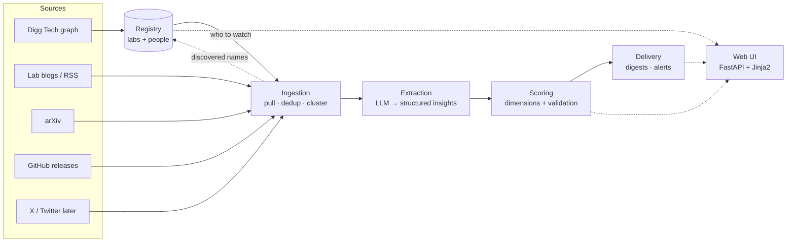
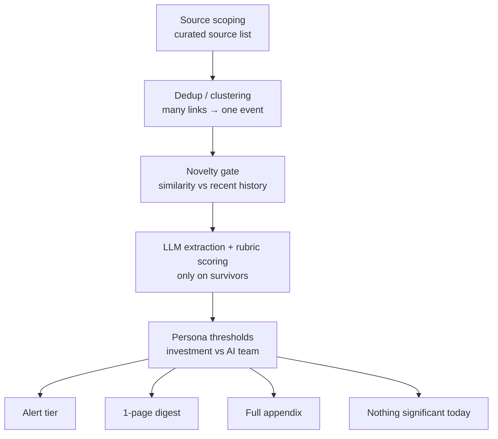
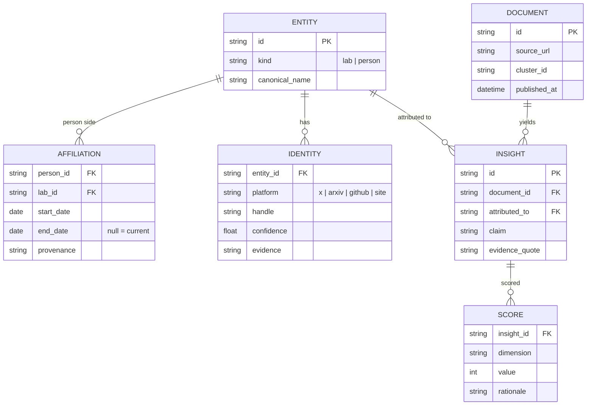

# Architecture Overview

Living map of Frontier Lab Intelligence. Update this file when the system
shape changes: new pipeline stage, schema boundary, source class, or module.

Status: data-first bootstrap. The implemented code has raw fetch/store,
Digg-derived seed graph extraction, and a lightweight web shell. The modeled
registry/extraction/scoring schema is intentionally not locked yet.

## Stack

One Python codebase, one SQLite database, one small server-rendered web app.

| Layer | Choice | Why |
| --- | --- | --- |
| Language/package | Python 3.13, `src/fli/` | Most rubric weight is data, LLM, scoring, and ingestion work. |
| Database | SQLite | The prompt asks for a database; a single inspectable file is reviewer-friendly. |
| Web UI | FastAPI + Jinja2 + plain CSS | UI is 5% of the rubric; avoid a separate frontend stack. |
| Pipeline | CLI subcommands | Each stage should be independently runnable, testable, and demoable. |
| Scheduling | Simple cron/loop later | Scheduled ingestion does not need queue infrastructure yet. |

Rejected for now: React/Next split frontend, Streamlit/Gradio toy-dashboard
shape, and Dobby/personal-memory architecture inside this product repo.

## System pipeline



Target stages:

1. **Registry:** labs, people, identities, affiliations, provenance.
2. **Ingestion:** public source pulls, dedup, clustering, freshness.
3. **Extraction:** structured/cited insights from surviving documents.
4. **Scoring:** visible dimensions plus validation, not an arbitrary weighted sum.
5. **Delivery:** persona digests, alerts, reviewable UI, PDF/export later.

## Signal Funnel



Judgment is meant to live in two visible places: source selection and scoring
rubrics. Everything else should be mechanical and testable.

Design principles borrowed from prior art:

- Curated source lists and denominator disclosure from smol.ai/AI News.
- "Nothing significant today" as a trust-preserving output.
- Machine proposes, human disposes from Techmeme/Digg-style workflows.
- Reason-for-inclusion labels instead of one opaque score.
- Time decay and noise dampeners for freshness.
- Dated affiliations because people moves are themselves a signal.

## Current Data

Implemented raw table:

```text
raw_items(id, source, lab, external_id, fetched_at, payload)
```

Current file artifacts:

```text
data/fli.db                         # raw evidence SQLite corpus
data/digg/rankings.csv              # 1,000 ranked Digg/X accounts
data/digg/top_follower_edges.csv    # tracked first-slice top-follower edges
data/digg/seed_graph.json           # tracked nested Digg review artifact
data/digg/full_graph_summary.json   # summary of full paginated local pull
data/raw/digg-full-2026-07-08/      # ignored full graph artifacts
```

Known data facts:

- `fli fetch` landed 1,599 raw items from lab blogs/sitemap, arXiv, and
  GitHub releases.
- `fli digg` landed 1,000 ranked accounts and 49,950 tracked first-slice
  edges.
- `fli digg --full-followers` produced 361,225 local full-paginated edges;
  full raw files are ignored because they exceed normal git-hosting size.

## Target Data Model Sketch

This is a hypothesis to test against real candidate evidence, not a locked
schema.



Scoring dimensions under consideration: novelty, materiality, credibility,
actionability per persona, corroboration, and freshness. The combination into
a ranking should be checked against human/hindsight labels before becoming a
final score.

## Module Status

| Module | Status |
| --- | --- |
| `fli.cli` | `--version`, `fetch`, `digg`, `web` |
| `fli.digg` | Digg rankings and top-follower graph extraction |
| `fli.store` | raw `raw_items` SQLite layer |
| `fli.fetch` | raw fetch spike for blogs/sitemap, arXiv, GitHub releases |
| `fli.web` | shell: home + `/architecture` |
| `fli.registry` | pending, schema from candidate evidence next |
| `fli.ingest` | pending production ingestion; raw fetch spike exists |
| `fli.extract` | pending |
| `fli.scoring` | pending |
| `fli.delivery` | pending |

## Build Order

1. Build a reviewable registry-candidate table from Digg + raw evidence.
2. Decide the first modeled registry schema from reviewed candidates.
3. Promote raw fetch into production ingestion around the accepted registry.
4. Extract and score real ingested data.
5. Add validation harness and ground-truth labeling.
6. Delivery and UI last.
