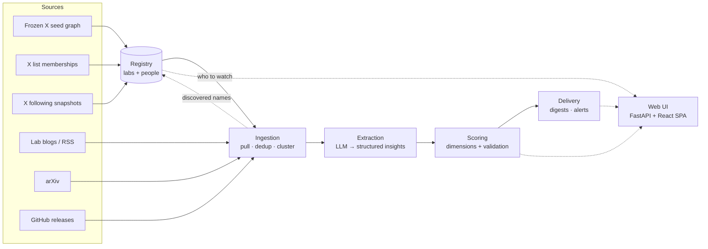
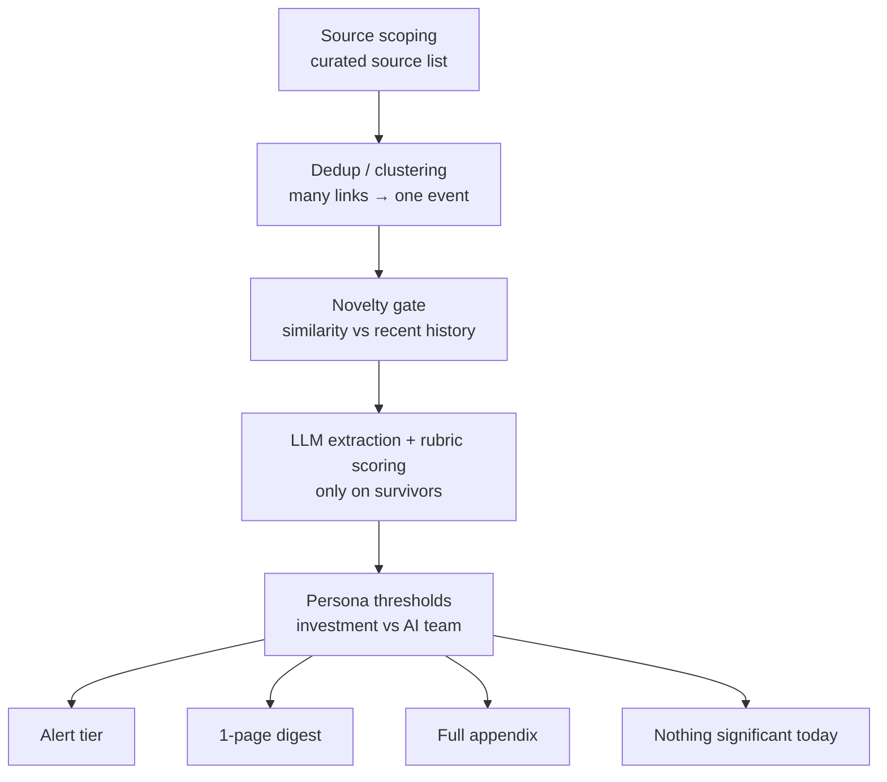
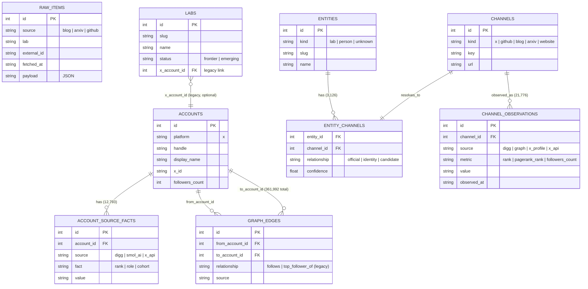
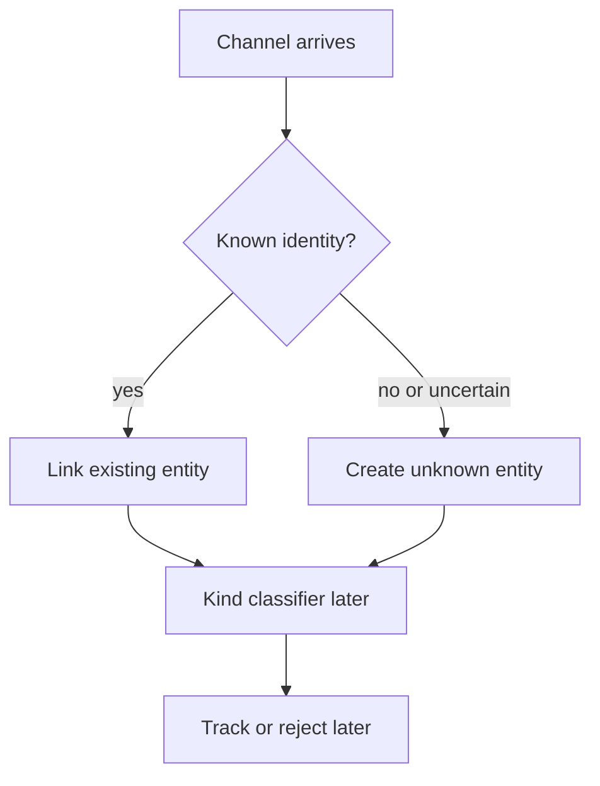
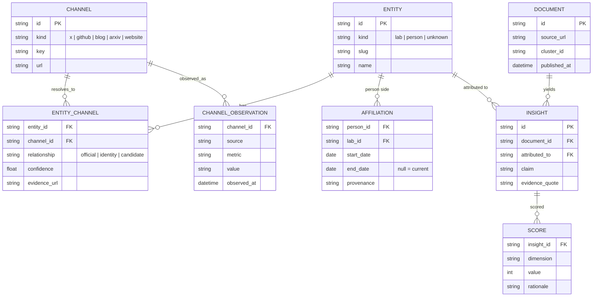

# Architecture Overview

Living map of Frontier Lab Intelligence. Update this file when the system
shape changes: new pipeline stage, schema boundary, source class, or module.

Status: entity-spine bootstrap. The implemented code has raw fetch/store, a
frozen X seed graph snapshot, a modeled SQLite graph layer, and a React SPA
over a JSON API. Every observed channel now resolves to one entity; known labs
are classified and every other identity remains `unknown` until a later agent
classifies it. Extraction and scoring schemas are intentionally not locked yet.

## Stack

One Python codebase, one SQLite database, one React SPA served by the API.

| Layer | Choice | Why |
| --- | --- | --- |
| Language/package | Python 3.13, `src/fli/` | Most rubric weight is data, LLM, scoring, and ingestion work. |
| Database | SQLite | The prompt asks for a database; a single inspectable file is reviewer-friendly. |
| Web UI | React + Vite + TS SPA over a FastAPI JSON API; sigma.js for graph viz | Decided 2026-07-08: the UI doubles as our data-inspection surface (graph + candidate review), which server-rendered Jinja2 handles poorly. Same stack as Adi's other apps. Identity: `DESIGN.md` cobalt/brass, not adi-design. |
| Pipeline | CLI subcommands | Each stage should be independently runnable, testable, and demoable. |
| Scheduling | Simple cron/loop later | Scheduled ingestion does not need queue infrastructure yet. |

Rejected for now: Next.js/SSR frameworks (a static Vite SPA on a JSON API is
enough), Streamlit/Gradio toy-dashboard shape, and Dobby/personal-memory
architecture inside this product repo. Jinja2 server-rendered pages were the
original choice and are being retired in favor of the SPA.

## System pipeline



Target stages:

1. **Registry:** labs, people, identities, affiliations, provenance.
2. **Ingestion:** public source pulls, dedup, clustering, freshness.
3. **Extraction:** structured/cited insights from surviving documents.
4. **Scoring:** visible dimensions plus validation, not an arbitrary weighted sum.
5. **Delivery:** persona digests, alerts, reviewable UI, PDF/export later.

## Signal Funnel



Judgment is meant to live in two visible places: source selection and scoring
rubrics. Everything else should be mechanical and testable.

Design principles borrowed from prior art:

- Curated source lists and denominator disclosure from smol.ai/AI News.
- "Nothing significant today" as a trust-preserving output.
- Machine proposes, human disposes from Techmeme-style workflows.
- Reason-for-inclusion labels instead of one opaque score.
- Time decay and noise dampeners for freshness.
- Dated affiliations because people moves are themselves a signal.

## Current Data

Implemented raw table:

```text
raw_items(id, source, lab, external_id, fetched_at, payload)
```

Current file artifacts:

```text
data/fli.db                         # raw evidence SQLite corpus
data/digg/rankings.csv              # frozen bootstrap ranked X accounts
data/digg/top_follower_edges.csv    # frozen bootstrap first-slice edges
data/digg/seed_graph.json           # frozen nested review artifact
data/digg/full_graph_summary.json   # summary of full paginated local pull
data/raw/digg-full-2026-07-08/      # ignored frozen raw graph artifacts
```

Current source-import commands:

```text
fli sources import-x-list --list-id <x-list-id> --source <source_key>
fli sources import-x-following --username <x-handle> --source <source_key>
```

The first provider implementation is TwitterAPI.io. It reads its API key from
`~/.secrets/twitterapi-io/api-key`, mirrors X accounts into channels, emits one
JSON object, and pages until the provider says there is no next page. List
imports write membership facts. Following imports atomically replace one
complete snapshot with `followed_by` facts plus directed `follows` edges. Neither
command classifies imported accounts or approves them for tracking.

Known data facts:

- `fli fetch` landed 1,599 raw items from lab blogs/sitemap, arXiv, and
  GitHub releases.
- The frozen bootstrap graph landed 1,000 ranked accounts and 49,950
  first-slice edges.
- The full frozen bootstrap pull produced 361,225 local full-paginated edges;
  full raw files are ignored because they exceed normal git-hosting size.
- `fli channels sync` currently materializes 3,094 entities (10 labs and 3,084
  unknowns), 3,126 channels (3,094 X plus lab websites/GitHub/arXiv/blog
  feeds), 3,126 entity-channel links, and 21,776 channel observations.
- `fli sources import-x-list --list-id 1585430245762441216 --source
  ai_high_signal` imported 609 AI High Signal X-list members via
  TwitterAPI.io; 230 were already in the Digg bootstrap and 379 were new
  versus Digg.
- smol.ai AINews `prefPeople` imported 31 unique X handles from its pinned
  public GitHub source. Twenty-three already existed and eight new accounts
  were added; 21 overlap AI High Signal, 17 overlap Digg, and 17 occur in all
  three sources.
- `fli sources import-x-following --username adithyan_ai --source
  adi_following` imported a complete 767-account outgoing-follow snapshot on
  2026-07-10. It matched 282 existing accounts, added 485 followed accounts
  plus the source account, and wrote 767 directed `follows` edges. The provider
  estimated 934 credits / $0.00934 for the four pages.

### Current Schema (as built, not the target sketch)

This is what actually exists in `data/fli.db` today (9 tables). It mixes two
generations: a legacy X-graph import layer (`accounts`, `account_source_facts`,
`graph_edges`, plus `labs.x_account_id`) and the newer entity/channel product
layer (`entities`, `channels`, `entity_channels`, `channel_observations`).
`raw_items` is an unconnected bootstrap table. Row counts as of this writing
in parentheses.



Table row counts: `raw_items` 1,599, `accounts` 3,094,
`account_source_facts` 12,793, `graph_edges` 361,992, `labs` 10,
`entities` 3,094, `channels` 3,126, `entity_channels` 3,126,
`channel_observations` 21,776.

Note `raw_items` has no foreign keys into the rest of the schema yet — it is
the as-fetched evidence corpus, not joined to entities/channels until
ingestion/extraction lands. The `accounts` / `account_source_facts` /
`graph_edges` trio is the legacy bootstrap X import layer described above; it
still backs the graph viz but is being superseded by `entities` / `channels`
/ `entity_channels` / `channel_observations` as the product's canonical model.

## Entity / Channel Model

The case prompt asks for labs and individuals as first-class entities, resolved
across X, GitHub, arXiv, and official lab channels. The model is therefore:

```text
entities              # who: OpenAI, Anthropic, Andrej Karpathy
channels              # where: @openai, OpenAI blog, github.com/openai
entity_channels       # evidence/confidence that a channel belongs to an entity
channel_observations  # measured/source-specific facts about a channel over time
```

Entity is identity, not endorsement. A channel that cannot yet be resolved
creates a provisional `unknown` entity. Kind classification (`lab`, `person`,
`unknown`) and curation (`track`, `reject`) are separate later stages.



Exact rules and the future classifier contract live in
`docs/references/registry-curation.md`.

Rule of thumb:

```text
Entity = who
Channel = where we observe them
Entity channel = proof that this where belongs to that who
Observation = what we saw there at a time
```

Current implemented tables:

```text
entities(id, kind, slug, name, notes, created_at, updated_at)
channels(id, kind, key, label, url, first_seen_at, last_seen_at)
entity_channels(entity_id, channel_id, relationship, confidence, evidence_url, notes)
channel_observations(channel_id, source, metric, value, observed_at, evidence_url)
```

The old `accounts`, `account_source_facts`, and `graph_edges` tables remain as
the X graph import backing layer. They are not the product model. X accounts are
mirrored into `channels(kind='x')`, and seed/PageRank/profile fields are copied
into `channel_observations`. The current rows from the old Digg pull are a
frozen bootstrap source, not the center of the schema.

## X Graph Source Direction

The live graph direction is our own X following snapshots, not more Digg. Pull
**who trusted accounts follow**, not the full follower audience of large
accounts. The first snapshot is Adi's 767 outgoing follows; it is personal
attention evidence, not automatic frontier relevance.

```text
curated X watchlist
  -> GET following for each trusted X user
  -> graph_edges(source=<snapshot source>, relationship='follows')
  -> PageRank over the observed follows graph
  -> people candidates for curation
```

Why this direction:

- Followers of a large account are mostly audience and spam.
- Following lists from frontier researchers/labs are a higher-signal attention
  graph.
- Costs stay bounded because the watchlist is curated and each edge has a
  source snapshot/evidence URL.
- Third-party X data APIs can be evaluated later, but the official API shape is
  the cleanest story for a case-study product.

Do not recompute one blended PageRank merely because a new source lands. The
current Digg follower graph and trusted-person following graph have different
semantics; choose and validate their weighting before combining them.

Examples:

```text
Entity: OpenAI
Channels: @openai, openai.com/news/rss.xml, github.com/openai, arXiv query

Entity: Andrej Karpathy (future curation pass)
Channels: @karpathy, github.com/karpathy, arXiv author/query
```

## Target Data Model Sketch

This is a hypothesis to test against real candidate evidence, not a locked
schema.



Scoring dimensions under consideration: novelty, materiality, credibility,
actionability per persona, corroboration, and freshness. The combination into
a ranking should be checked against human/hindsight labels before becoming a
final score.

## Module Status

| Module | Status |
| --- | --- |
| `fli.cli` | `--version`, `fetch`, `digg`, `graph`, `labs`, `web` |
| `fli.digg` | frozen Digg bootstrap importer; not the target live graph source |
| `fli.store` | raw `raw_items` SQLite layer |
| `fli.graph` | legacy X graph import backing layer (`accounts`, facts, edges); PageRank; mirrors observations into channels |
| `fli.channels` | canonical entity/channel model; `fli channels sync\|summary` |
| `fli.labs` | curated lab seed data (10 labs); seeds lab entities + official channels |
| `fli.fetch` | raw fetch spike for blogs/sitemap, arXiv, GitHub releases |
| `fli.sources` | machine-readable TwitterAPI.io X-list and outgoing-follow importers; provenance only, no classification |
| `fli.web` | JSON API (`/api/status`, `/api/accounts`, `/api/registry`) + built SPA host; Registry exposes the full lab/person/unknown universe; source in `frontend/` |
| `fli.registry` | channel ownership invariant, provisional unknown materialization, and lean Registry read model; kind classifier still pending |
| `fli.ingest` | pending production ingestion; raw fetch spike exists |
| `fli.extract` | pending |
| `fli.scoring` | pending |
| `fli.delivery` | pending |

## Build Order

1. Finish the entity/channel registry foundation and people promotion path.
2. Promote raw fetch into production ingestion around accepted entity channels.
3. Extract and score real ingested data.
4. Add validation harness and ground-truth labeling.
5. Delivery and UI last.
