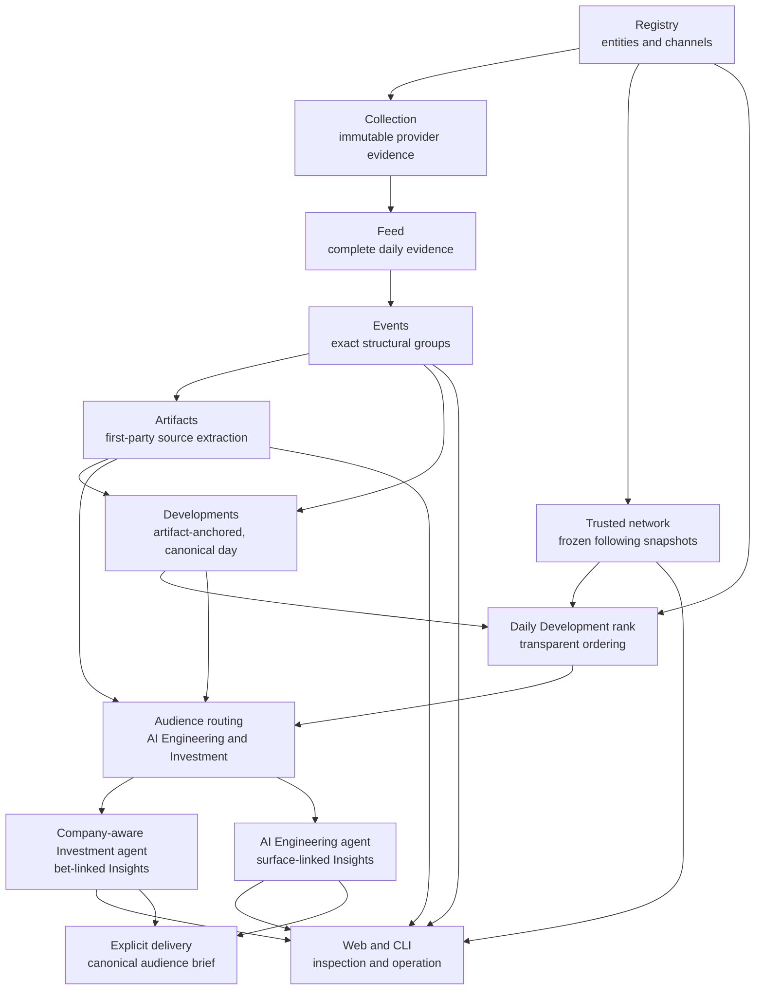

# Architecture Overview

Frontier Lab Intelligence separates deterministic evidence construction from
model judgment. Independent Investment and AI Engineering generators use one
shared evidence core, with their own stores and read projections.

The runtime is parked. `docs/references/service-lifecycle.md` governs resume;
this document describes ownership, not permission to run the pipeline.

## Boundaries that matter

- Registry owns identity and provenance; ingestion preserves immutable provider
  responses. Raw/paid evidence is retained so rebuilding derived state does not
  require refetching it.
- Feed materializes complete UTC-day evidence. Events group exact structural
  relationships, not topic similarity. Developments group accepted canonical
  artifacts and belong to their earliest accepted Event day; later disclosures
  must not republish the same Development on a second day.
- Ranking is deterministic and inspectable. Routing independently judges each
  audience using first-party source evidence; reactions can inform rank without
  silently becoming semantic evidence. Missing/unreadable evidence is disclosed.
- Investment connects Developments to memo-owned standing bets; memo direction
  is resolved by code. Engineering connects evidence to its versioned surface
  map. Model schemas, loop ceilings, and versions are owned by the generators
  and exposed through `fli insights contract`.
- Complete cohort publication separates stored attempts from reader-visible
  results. Keep frozen evidence, prompt identity, model telemetry, and trace
  provenance together. Readers cannot mix partial reruns or incompatible versions.
- Web, CLI, PDF, and delivery consume canonical audience projections; they do
  not create competing Insight truth. PDF caches are rebuildable acceleration.
  Each external send is explicit; no alert scheduler is implied.
- `fli.paths` maps logical data paths to guarded physical storage. Preserve UUID
  checks and logical artifact identities when relocating data.
- Shared model behavior belongs in `fli.llm_responses`, diagnostics in
  `fli.diagnostics`, and domain behavior in its package. Active prompts use
  stable filenames; immutable run metadata records versions and hashes.

## Find the owner

[Code and data ownership](code-map.md) maps packages, stores, commands, and
mirrored tests. [The contract index](../references/implementation-contracts.md)
routes exact schemas and operational rules. Use source for implementation detail;
update this overview when ownership or dependency direction changes.

- [Evidence publication and refresh](../references/evidence-refresh.md)
- [Feed/Event semantics](../references/signal-feed.md)
- [Artifact lineage](../references/artifact-library.md)
- [Audience refresh and publication](../references/insight-refresh.md)
- [Data lifecycle and recovery](../references/data-lifecycle.md)
- [Model routing](../references/model-routing.md) and [cache proof](../references/prompt-caching.md)
- [Conceptual status and remaining proof](../STATUS.md)

`scripts/check-fast.sh` is the checked maintenance entrypoint. Parked mode
skips absent runtime dependencies explicitly; an authorized runtime change uses
`--require-runtime` after restoring dependencies. See the lifecycle reference
for the exact proof boundary.
