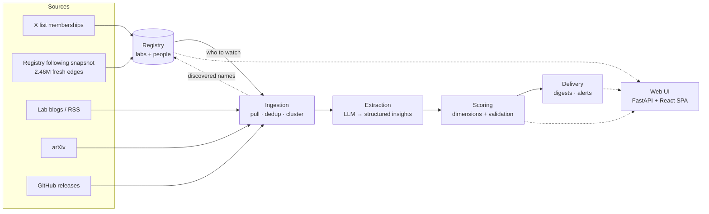
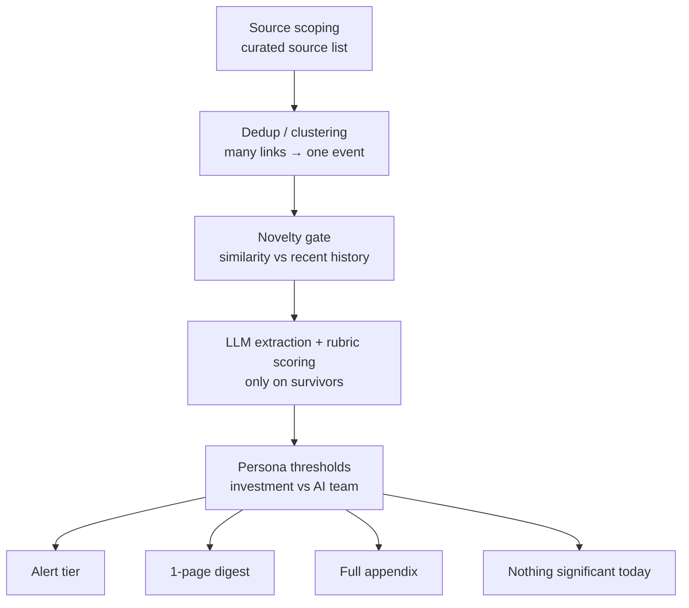
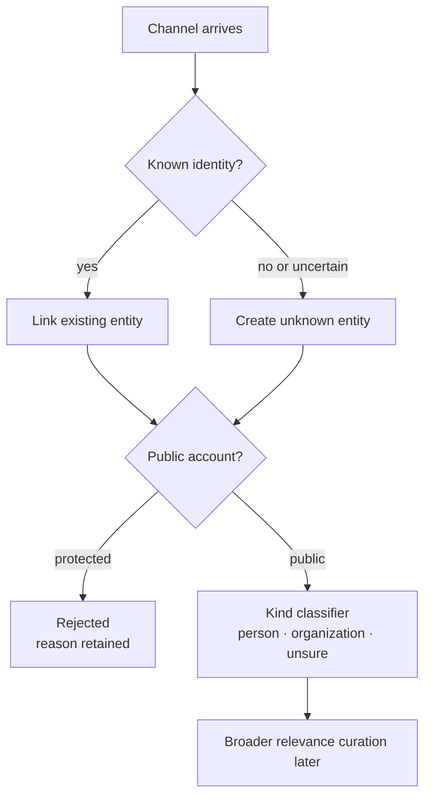
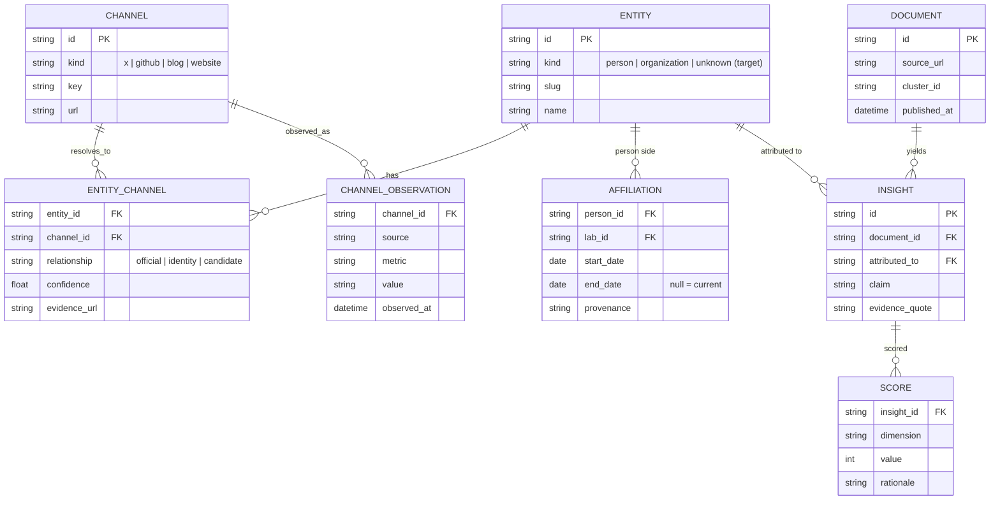

# Architecture Overview

Living map of Frontier Lab Intelligence. Update this file when the system
shape changes: new pipeline stage, schema boundary, source class, or module.

Status: entity spine and entity-kind classification are complete. The active
Registry retains the relevance-reviewed post-floor universe: 2,114 active
people, 86 active organizations, zero active unsure, 13 rejected, and zero
unknown.
Rejected is a reason-bearing curation state, not a structural kind. The rejected Digg
edge plane, its derived PageRank, and the exploratory personal following
snapshot have been removed without deleting the classified nodes. The Digg
1,000-account ranking survives only as an offline comparison CSV; the active
graph is empty at the cleanup checkpoint. A frozen broad Registry-cohort
outgoing-follow snapshot is now complete; the next graph step is a smaller
reviewed PageRank personalization set and ranking comparison. The `labs` table remains internal source/seed provenance
because its 10 rows are not an
exhaustive lab classification; it is not exposed as a Registry kind, badge,
count, or filter.
Reviewed organization consolidation is live: SpaceX owns `@spacex` and
`@SpaceXAI`, and eleven additional canonical organizations own 21 explicit
product/developer/subgroup X channels. Every batch is manifest-driven, preflighted,
transactional, idempotent, and audit-recorded. Relevance curation is complete
for this checkpoint; production ingestion, extraction, and scoring remain later
stages.
Exact human name/kind corrections are separately versioned in
`data/registry/entity-overrides.json` and recorded in
`entity_override_audit`; they never rewrite model-classification provenance.

Product relevance is a separate gate after structural kind. The reusable
`registry-relevance-v1` prompt and strict schema run one entity per
Terra-high Responses request with required hosted web search; follower count is
not an input. Results and consulted sources remain review artifacts with no
canonical write path. Approved removals are versioned in
`data/registry/relevance-removals.csv` and
applied only through `fli registry apply-relevance-removals`. The command
preflights the complete manifest, protects seeded labs, merge canonicals,
rejections, multi-channel identities, and graph participants, then removes each
approved one-account identity in one transaction. It supports dry-run and
idempotent replay; it does not turn model output directly into deletion.

`fli.llm_responses` is the shared provider-normalization boundary for these
Responses calls. It extracts only final message text, tolerates nullable blocks
from translated responses, and normalizes hosted-search actions and cited URLs.
Claude-native web search uses `tool_choice=auto` so the model can finish after
searching; the audit still rejects any response with no observed search action.

## Stack

One Python codebase, one SQLite database, one React SPA served by the API.

| Layer | Choice | Why |
| --- | --- | --- |
| Language/package | Python 3.13, `src/fli/` | Most rubric weight is data, LLM, scoring, and ingestion work. |
| Database | SQLite | The prompt asks for a database; a single inspectable file is reviewer-friendly. |
| Web UI | React + Vite + TS SPA over a FastAPI JSON API; sigma.js for graph viz | Decided 2026-07-08: the UI doubles as our data-inspection surface (graph + candidate review), which server-rendered Jinja2 handles poorly. Same stack as Adi's other apps. Identity: `DESIGN.md` cobalt/brass, not adi-design. |
| Pipeline | CLI subcommands | Each stage should be independently runnable, testable, and demoable. |
| Scheduling | Simple cron/loop later | Scheduled ingestion does not need queue infrastructure yet. |

Rejected for now: Next.js/SSR frameworks (a static Vite SPA on a JSON API is
enough), Streamlit/Gradio toy-dashboard shape, and Dobby/personal-memory
architecture inside this product repo. Jinja2 server-rendered pages were the
original choice and are being retired in favor of the SPA.

## System pipeline



Target stages:

1. **Registry:** labs, people, identities, affiliations, provenance.
2. **Ingestion:** public source pulls, dedup, clustering, freshness.
3. **Extraction:** structured/cited insights from surviving documents.
4. **Scoring:** visible dimensions plus validation, not an arbitrary weighted sum.
5. **Delivery:** persona digests, alerts, reviewable UI, PDF/export later.

## Signal Funnel



Judgment is meant to live in two visible places: source selection and scoring
rubrics. Everything else should be mechanical and testable.

Design principles borrowed from prior art:

- Curated source lists and denominator disclosure from smol.ai/AI News.
- "Nothing significant today" as a trust-preserving output.
- Machine proposes, human disposes from Techmeme-style workflows.
- Reason-for-inclusion labels instead of one opaque score.
- Time decay and noise dampeners for freshness.
- Dated affiliations because people moves are themselves a signal.

## Current Data

Implemented raw table:

```text
raw_items(id, source, lab, external_id, fetched_at, payload)
```

Current file artifacts:

```text
data/fli.db                         # raw evidence SQLite corpus
data/digg/rankings.csv              # offline Digg comparison baseline only
data/following/cohorts/*.json       # frozen broad collection membership
data/raw/following/*/snapshot.db    # ignored local raw pages + fresh edges
docs/references/digg-ranking-baseline.md
```

Current source-import commands:

```text
fli sources import-x-list --list-id <x-list-id> --source <source_key>
fli sources import-x-following --username <x-handle> --source <source_key>
fli following-snapshot freeze-cohort --cohort-id <id> --output <path>
fli following-snapshot init --snapshot-id <id> --cohort <path>
fli following-snapshot status|validate --snapshot-db <path>
fli following-snapshot finalize --snapshot-db <path>
fli following-snapshot collect --snapshot-db <path> --handle <x-handle>
fli following-snapshot collect --snapshot-db <path> --all --profiles-only
fli following-snapshot collect --snapshot-db <path> --all --workers 20
```

The first provider implementation is TwitterAPI.io. It reads its API key from
`~/.secrets/twitterapi-io/api-key`, mirrors X accounts into channels, emits one
JSON object, and pages until the provider says there is no next page. List
imports write membership facts. Following imports atomically replace one
complete snapshot with `followed_by` facts plus directed `follows` edges. Neither
command classifies imported accounts or approves them for tracking.

The broad PageRank collection no longer uses that legacy whole-import path.
`fli.following_snapshots` freezes the active Registry cohort into tracked JSON
and initializes one isolated, ignored `following-snapshot-v1` SQLite database.
Its page cache is keyed by snapshot, stable source X ID, and request cursor;
each transaction stores canonical raw provider JSON before normalized accounts
and directed source→target edges. Source state distinguishes pending,
in-progress, complete, protected, missing, unavailable, and failed. Identical
page retries are no-ops, conflicting retries fail closed, and completed
snapshots are immutable. `status`, `validate`, and `finalize` are JSON-first,
non-interactive inspection/lifecycle commands. Initialization itself makes no
external request. Ranking will require an explicit snapshot database rather
than reading `data/fli.db` edges.

Bounded collection is now implemented. Every paid run requires an explicit
handle, source limit, or `--all`. Source profiles are cached before following
pages, so profile and cursor evidence both survive interruption. Profile-only
scans and full collection may use parallel source workers behind one
request-start QPS limiter; exactly one worker owns each source, so its pages
remain sequential and cursor-safe. The first live calibration paused
`@karpathy` after one 200-edge page, resumed without repeating that profile or
page, and completed at 1,108 edges across six pages. The all-source profile
scan cached 2,228 current follower/following counts, marked nine protected and
three missing sources, and completed 12 zero-following sources without a paid
following request. The authorized full run completed all 2,206 remaining
accessible sources at 20 workers / 9 QPS with zero crawl failures. The immutable
snapshot contains 13,409 raw pages, 463,180 distinct target accounts, and
2,456,305 directed edges; its best-available provider-cost estimate is
`$27.81218`. The tracked manifest binds those facts to the local 2.0 GB database
checksum. Ranking and evaluation remain next.

Known data facts:

- `fli fetch` landed 1,599 raw items from lab blogs/sitemap, arXiv, and
  GitHub releases.
- The active graph has zero edges. The 360,667 Digg edges, derived PageRank,
  graph-only candidates, raw edge artifacts, and exploratory personal
  following snapshot were removed on 2026-07-10.
- The Registry retains 2,213 classified entities: 2,114 active people, 86
  active organizations, zero active unsure, and 13 rejections. The
  2,259 channels include 24 website/GitHub/blog lab channels plus 22 X/product
  channels consolidated into existing organizations. The approved relevance
  manifest contains 689 exact one-X removals. The final organization pass
  applies Adi's temporary 10,000-follower floor; lower-reach organizations may
  be rediscovered later through trusted-follow PageRank evidence.
- Every account carries a neutral `registry_bootstrap.retained_candidate`
  marker. The 1,853 accounts actually observed through Digg also carry one
  `digg_bootstrap.candidate_origin` value (`ranked`, `graph_node`, or both).
  These are provenance only—not graph edges or ranking inputs.
- `data/digg/rankings.csv` retains the frozen 1,000-account Digg ranking only
  for later comparison. It is not imported into the active database.
- `fli sources import-x-list --list-id 1585430245762441216 --source
  ai_high_signal` imported 609 AI High Signal X-list members via
  TwitterAPI.io; 230 were already in the Digg bootstrap and 379 were new
  versus Digg.
- smol.ai AINews `prefPeople` imported 31 unique X handles from its pinned
  public GitHub source. Twenty-three already existed and eight new accounts
  were added; 21 overlap AI High Signal, 17 overlap Digg, and 17 occur in all
  three sources.

### Current Schema (as built, not the target sketch)

This is what actually exists in `data/fli.db` today. The `accounts`,
`account_source_facts`, and empty `graph_edges` tables back X source imports;
the product model is `entities`, `channels`, `entity_channels`, and
`channel_observations`.
The classifier adds separate run, classification, and error tables. Registry
rejections remain separate from structural kind in
`entity_registry_rejections`; applied identity merges are recorded in
`entity_merge_audit`, and reviewed name/kind corrections in
`entity_override_audit`.
`raw_items` is an unconnected bootstrap table. Row counts as of this writing
are in parentheses.

The Registry read model also exposes nullable `followers_count` as the sum of
the latest stored X-account follower counts owned by each entity. All, People,
and Organizations default to descending by this value and accept an explicit
ascending/descending API direction; People labels it X followers, while All
and Organizations label it Combined X followers because one entity may own
several channels. Missing observations remain null and sort last. This is a
presentation proxy, not graph evidence or a canonical importance score.

```mermaid
erDiagram
    RAW_ITEMS {
        int id PK
        string source "blog | arxiv | github"
        string lab
        string external_id
        string fetched_at
        string payload "JSON"
    }
    ACCOUNTS {
        int id PK
        string platform "x"
        string handle
        string display_name
        string x_id
        int followers_count
    }
    ACCOUNT_SOURCE_FACTS {
        int id PK
        int account_id FK
        string source "ai_high_signal | smol_ai"
        string fact "list_member"
        string value
    }
    GRAPH_EDGES {
        int id PK
        int from_account_id FK
        int to_account_id FK
        string relationship "follows"
        string source
    }
    LABS {
        int id PK
        string slug
        string name
        string status "frontier | emerging"
        int x_account_id FK "legacy link"
    }
    ENTITIES {
        int id PK
        string kind "person | organization | unsure | unknown (provisional)"
        string slug
        string name
    }
    CHANNELS {
        int id PK
        string kind "x | github | blog | website"
        string key
        string url
    }
    ENTITY_CHANNELS {
        int entity_id FK
        int channel_id FK
        string relationship "official | identity | candidate"
        float confidence
    }
    CHANNEL_OBSERVATIONS {
        int id PK
        int channel_id FK
        string source "ai_high_signal | smol_ai | x_profile"
        string metric "list_member | followers_count"
        string value
        string observed_at
    }
    ENTITY_KIND_CLASSIFICATION_RUNS {
        int id PK
        string model
        string reasoning_effort
        string prompt_version
        string status
        int input_tokens
        int output_tokens
        float estimated_cost_usd
        float reported_cost_usd
        string request_tags "JSON array"
    }
    ENTITY_KIND_CLASSIFICATIONS {
        int entity_id FK
        string input_sha256
        string classification "person | organization | unsure"
        string reason
        string prompt_version
        string reasoning_effort
        float reported_cost_usd
        int run_id FK
    }
    ENTITY_KIND_CLASSIFICATION_ERRORS {
        int id PK
        int run_id FK
        int entity_id FK
        string error_type
        int terminal
    }
    ENTITY_REGISTRY_REJECTIONS {
        int entity_id PK,FK
        string reason_code
        string reason
        string source
        string evidence_url
        string rejected_at
    }
    ENTITY_KIND_WEB_ENRICHMENTS {
        int entity_id FK
        string input_sha256
        string classification "person | organization | unsure"
        string reason
        string prompt_version "entity-kind-web-v1"
        string actions_json
        string sources_json
        float reported_cost_usd
        int run_id FK
    }

    ACCOUNTS ||--o{ ACCOUNT_SOURCE_FACTS : "has (4,610)"
    ACCOUNTS ||--o{ GRAPH_EDGES : "from_account_id"
    ACCOUNTS ||--o{ GRAPH_EDGES : "to_account_id (0 current)"
    LABS }o--|| ACCOUNTS : "x_account_id (legacy, optional)"
    LABS ||--|| ENTITIES : "internal seed provenance by slug"
    ENTITIES ||--o{ ENTITY_CHANNELS : "has (2,259)"
    CHANNELS ||--|| ENTITY_CHANNELS : resolves_to
    CHANNELS ||--o{ CHANNEL_OBSERVATIONS : "observed_as (10,805)"
    ENTITY_KIND_CLASSIFICATION_RUNS ||--o{ ENTITY_KIND_CLASSIFICATIONS : "produced (2,306)"
    ENTITY_KIND_CLASSIFICATION_RUNS ||--o{ ENTITY_KIND_CLASSIFICATION_ERRORS : "records (0)"
    ENTITY_KIND_CLASSIFICATION_RUNS ||--o{ ENTITY_KIND_WEB_ENRICHMENTS : "stages (1)"
    ENTITIES ||--o{ ENTITY_KIND_CLASSIFICATIONS : "classified independently"
    ENTITIES ||--o{ ENTITY_KIND_WEB_ENRICHMENTS : "enriched independently"
    ENTITIES ||--o| ENTITY_REGISTRY_REJECTIONS : "may be rejected with reason"
    ENTITIES ||--o{ ENTITY_MERGE_AUDIT : "canonical identity records merges"
    ENTITIES ||--o{ ENTITY_OVERRIDE_AUDIT : "records reviewed corrections"
```



Table row counts: `raw_items` 1,599, `accounts` 2,235,
`account_source_facts` 4,610, `graph_edges` 0, `labs` 10,
`entities` 2,213, `channels` 2,259, `entity_channels` 2,259,
`channel_observations` 10,805, `entity_kind_classification_runs` 10,
`entity_kind_classifications` 2,306, `entity_kind_web_enrichments` 1,
`entity_kind_classification_errors` 0, `entity_registry_rejections` 13, and
`entity_merge_audit` 21, and `entity_override_audit` 3.

Note `raw_items` has no foreign keys into the rest of the schema yet — it is
the as-fetched evidence corpus, not joined to entities/channels until
ingestion/extraction lands. The `accounts` / `account_source_facts` /
`graph_edges` trio is the legacy bootstrap X import layer described above; it
still backs the graph viz but is being superseded by `entities` / `channels`
/ `entity_channels` / `channel_observations` as the product's canonical model.

## Entity / Channel Model

The case prompt asks for labs and individuals as first-class entities. The
identity model resolves them across X, GitHub, websites, and official feeds;
arXiv papers remain source documents for later extraction, not owned identity
channels. The model is therefore:

```text
entities              # who: OpenAI, Anthropic, Andrej Karpathy
channels              # where: @openai, OpenAI blog, github.com/openai
entity_channels       # evidence/confidence that a channel belongs to an entity
channel_observations  # measured/source-specific facts about a channel over time
```

Entity is identity, not endorsement. A channel that cannot yet be resolved
creates a provisional `unknown` entity. The canonical structural vocabulary is
`person`, `organization`, and `unsure`; `unknown` is only the pre-classification
lifecycle state. The 10 seeded rows in `labs` remain internal source provenance
and do not create a public subtype. There is no generic entity-role schema yet;
add one only after an exhaustive role policy is justified. Rejection remains a
separate curation state. An explicit protected-account flag is the first
implemented rejection gate; broader relevance curation remains later.

An entity may own multiple channels of the same kind. SpaceX owns the
independent X channels `@spacex` and `@SpaceXAI`; the reviewed batches add
21 product/developer/subgroup accounts to eleven canonical organizations. Each X account
keeps its own backing account row, profile observations, and source facts; only
the redundant organization entity is removed. A manifest reason and evidence
URL are retained in `entity_merge_audit`. Complete preflight plus one
`BEGIN IMMEDIATE` transaction make late validation failures and dry runs
all-or-nothing. The one-owner index on `entity_channels.channel_id` still
prevents any channel from belonging to two entities.



Exact rules and the accepted classifier contract live in
`docs/references/registry-curation.md`.

Rule of thumb:

```text
Entity = who
Channel = where we observe them
Entity channel = proof that this where belongs to that who
Observation = what we saw there at a time
```

Current implemented tables:

```text
entities(id, kind, slug, name, notes, created_at, updated_at)
channels(id, kind, key, label, url, first_seen_at, last_seen_at)
entity_channels(entity_id, channel_id, relationship, confidence, evidence_url, notes)
channel_observations(channel_id, source, metric, value, observed_at, evidence_url)
```

The `accounts`, `account_source_facts`, and `graph_edges` tables are source
import backing, not the product model. X accounts are mirrored into
`channels(kind='x')`. Neutral Digg/bootstrap origin markers remain, but no
Digg rank, score, edge, or PageRank observations remain.

### Active Classifier Boundary

The first LLM pass operates on each current unknown X-backed cluster
independently. Deterministic code supplies handle, display name, bio, and
profile URL. Structured model output contains exactly:

```json
{
  "classification": "person | organization | unsure",
  "reason": "Short identity-based explanation"
}
```

The model does not return identifiers, probability, model name, prompt version,
timestamp, or cost. The runner owns that metadata, resumability, concurrency,
and database association. It calls OpenAI models through the shared LiteLLM
proxy using `LLM_API_ENDPOINT` and `LLM_API_KEY`; the app does not use direct
Azure OpenAI credentials. Attention observations such as follower count,
PageRank, Digg rank, and list membership are excluded from this structural
classification.

Every request carries stable LiteLLM tags for app, pipeline, job, scope,
prompt, and run. The runner stores its official-rate estimate separately from
LiteLLM's reported response cost. The post-upgrade LiteLLM 1.91.1 verification
reconciled both values with the persisted spend log, including the tagged token
counts; proxy spend logs are the operational source of truth for billed usage.
The full Luna-medium prompt-v2 result set covers all 2,956 initial unknown
entities: 2,639 person, 172 organization, and 145 unsure. The atomic promotion
step validates the current input hash and accepted model/effort/prompt contract
before updating canonical kinds. The Registry exposes the stored reason in the
detail view. Seeded lab provenance remains internal and is not displayed.

`fli entity-kinds onboard --handle @name` is the canonical single-account
entrypoint. It fetches the provider profile, applies the 1,000-follower floor,
persists eligible profile evidence, and rejects protected accounts before any
model call. Public accounts enter one sequential Responses chain: profile;
then up to 20 authored posts after abstention; then one required hosted-web
turn, capped at four tool calls, after a second abstention. Every turn keeps the
same strict `classification` + `reason` schema and continues through
`previous_response_id`.

The runner commits the final decision and promotion immediately. Hosted-web
actions and deduplicated consulted/cited sources are stored separately in
`entity_kind_web_enrichments`; they do not expand the model-output schema.
Exact prompt/model results resume without another paid call. The batch
`fli entity-kinds enrich --limit N` path reuses the same staged lifecycle for
current abstentions.

Identity resolution may attach several X channels to one organization. A
person is expected to have one primary X account in most cases, but the data
model permits multiple channels for both people and organizations. The first
consolidation keeps SpaceX as the canonical entity, renames the stable former
`@xai` account to its current `@SpaceXAI` handle, and attaches it beside
`@spacex`; no historical-handle record is exposed.

## X Graph Source Direction

The product database's graph remains intentionally empty. The completed fresh
graph source is the outgoing-follow snapshot from the frozen,
relevance-screened Registry cohort,
where each source account is accessible—not followers of popular accounts and
not the offline Digg comparison ranking. Collection membership is not itself a
claim that every account deserves equal trust.

```text
frozen Registry X cohort
  -> GET following for each accessible X user
  -> graph_edges(source=<snapshot source>, relationship='follows')
  -> trusted-follow overlap baseline
  -> personalized PageRank from a smaller reviewed trust subset
  -> people candidates for curation
```

Why this direction:

- Followers of a large account are mostly audience and spam.
- Following lists from frontier researchers/labs are a higher-signal attention
  graph.
- Costs stay bounded because the source cohort is frozen and each edge has a
  source snapshot/evidence URL.
- Third-party X data APIs can be evaluated later, but the official API shape is
  the cleanest story for a case-study product.

Do not import the Digg comparison ranking or combine it with the new graph.
Compare outputs only after the fresh graph has been evaluated independently.
The 2,231-account active collection cohort, the smaller personalization subset, and
the ranked candidate output must remain separate inspectable artifacts.
Large raw pages and normalized edges live in an ignored per-snapshot SQLite
file rather than the Git-tracked product database. Git retains a small manifest
with cohort, completeness, cost, checksum, and result paths. See
`docs/references/following-snapshot-storage.md`.

Examples:

```text
Entity: OpenAI
Channels: @openai, openai.com/news/rss.xml, github.com/openai

Entity: Andrej Karpathy (future curation pass)
Channels: @karpathy, github.com/karpathy
```

## Target Data Model Sketch

This is a hypothesis to test against real candidate evidence, not a locked
schema.



Scoring dimensions under consideration: novelty, materiality, credibility,
actionability per persona, corroboration, and freshness. The combination into
a ranking should be checked against human/hindsight labels before becoming a
final score.

## Module Status

| Module | Status |
| --- | --- |
| `fli.cli` | `--version`, `web`, `fetch`, `labs`, `channels`, `registry`, `sources`, `entity-kinds`, `relevance-audit` |
| `fli.store` | raw `raw_items` SQLite layer |
| `fli.graph` | minimal account/source-fact/edge backing schema; no active importer or ranker; active edge count is zero |
| `fli.channels` | canonical entity/channel model; `fli channels sync\|summary` |
| `fli.labs` | internal curated source seed (10 historical rows); seeds official channels but does not define a public Registry kind/subtype |
| `fli.fetch` | raw fetch spike for blogs/sitemap, arXiv, GitHub releases |
| `fli.sources` | machine-readable TwitterAPI.io profile, timeline, X-list, and single-source outgoing-follow adapter; provenance only, no classification |
| `fli.web` | JSON API (`/api/status`, `/api/registry`) + built SPA host; Registry is server-paged, reach-sorted, searchable by identity fields, and exposes people, organizations, unsure results, rejections, and classifier reasons; source in `frontend/` |
| `fli.registry` | channel ownership invariant, provisional unknown materialization, and canonical Registry read model |
| `fli.relevance` | read-only, web-grounded Registry relevance audit using the versioned `registry-relevance-v1` prompt; emits cited review artifacts and cannot mutate canonical data |
| `fli.llm_responses` | shared normalization of OpenAI-compatible Responses text, hosted-search actions, and cited sources across native and translated providers |
| `fli.ingest` | pending production ingestion; raw fetch spike exists |
| `fli.extract` | pending |
| `fli.scoring` | pending |
| `fli.delivery` | pending |

## Build Order

1. Evaluate the isolated Registry-cohort outgoing-follow snapshot with overlap and personalized PageRank.
2. Promote raw fetch into production ingestion around accepted entity channels.
3. Extract and score real ingested data.
4. Add validation harness and ground-truth labeling.
5. Delivery and report UI.
